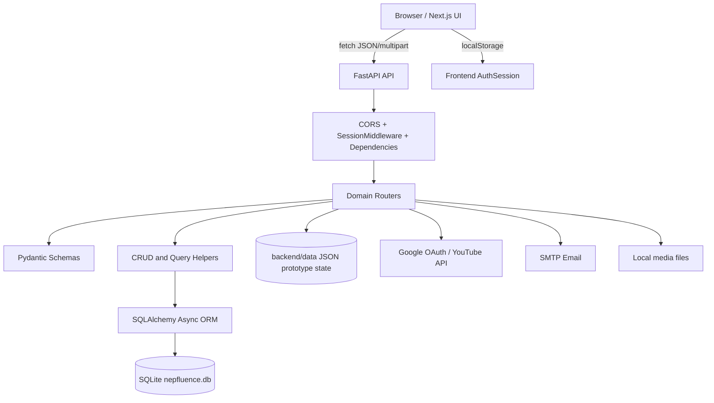
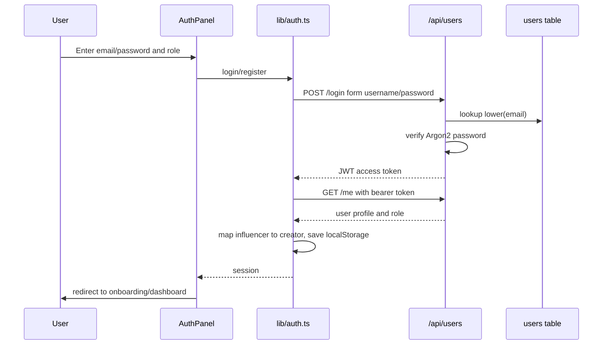
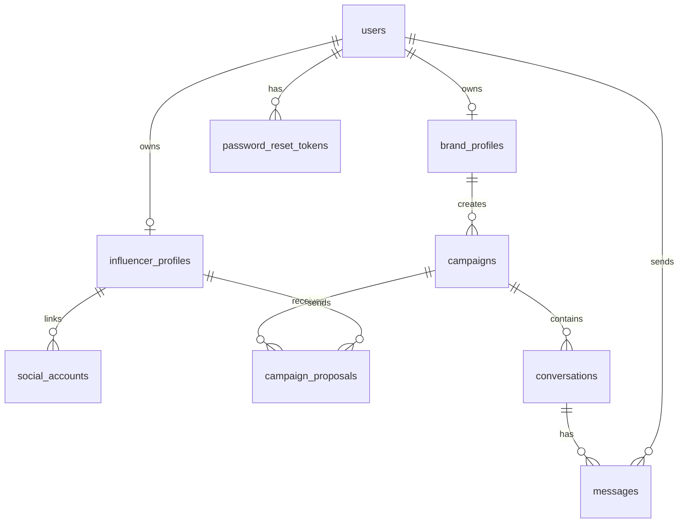
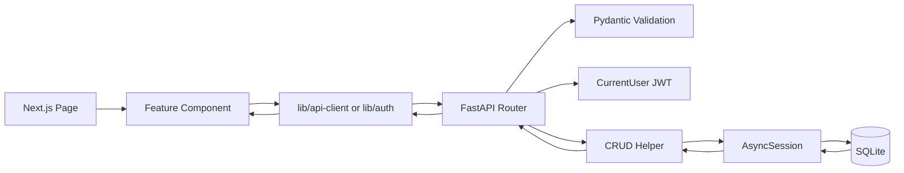
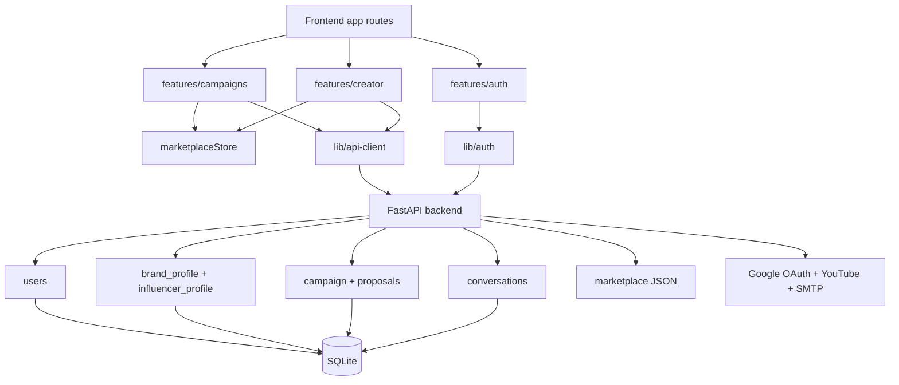

# PROJECT_DOCUMENTATION.md

Generated: 2026-07-13T23:12:10

This document was generated by static inspection of the Nepfluence repository. It excludes obvious build artifacts such as `.git`, `.next`, `node_modules`, virtual environments, bytecode caches, and compiled cache folders. Runtime artifacts that exist in the tree are documented separately.

# 1. Executive Summary

Nepfluence is a full-stack monorepo for connecting brands with influencers/creators for campaign marketing, discovery, applications/proposals, conversations, profiles, and prototype payments/collaboration workflows.

- **Frontend:** Next.js App Router, React, TypeScript, Tailwind CSS, Radix/shadcn-style UI primitives, lucide-react icons.
- **Backend:** FastAPI modular monolith, SQLAlchemy async ORM, Pydantic schemas, JWT auth, SQLite persistence, Google OAuth/YouTube, SMTP email.
- **Architecture:** browser UI calls REST APIs; backend validates requests, authenticates JWT bearer tokens, queries SQLite, and also supports prototype JSON marketplace state.
- **Status:** active MVP/prototype. Core auth, users, profiles, campaigns, proposals, conversations, and dashboards exist; testing/deployment hardening is limited.

# 2. Technology Stack

| Area | Technology | Evidence | Purpose |
|---|---|---|---|
| Frontend framework | Next.js | 16.2.1 | App Router UI |
| Frontend runtime | React / React DOM | 19.2.4 | Component rendering |
| Language | TypeScript / Python | TS frontend; Python >=3.13 backend | Typed UI and backend |
| Styling | Tailwind CSS | ^4 | Utility CSS |
| Backend framework | FastAPI | pyproject dependency | REST API and OpenAPI |
| ORM | SQLAlchemy async | pyproject dependency | Database access |
| Database | SQLite + aiosqlite | DATABASE_URL default | Local persistence |
| Authentication | JWT + Argon2/pwdlib | auth.py, pyjwt, pwdlib | Password and bearer token auth |
| OAuth/APIs | Google OAuth, YouTube API | google_auth.py, integrations/youtube | External auth and creator stats |
| Email | aiosmtplib | email_utils.py | Password reset/outreach email |
| Package managers | npm, uv | package-lock, uv.lock | Dependency management |

## Frontend Dependencies
| Package | Version | Purpose |
|---|---:|---|
| `class-variance-authority` | `^0.7.1` | Declared in `dependencies` for frontend runtime, UI, build, lint, or type tooling. |
| `clsx` | `^2.1.1` | Declared in `dependencies` for frontend runtime, UI, build, lint, or type tooling. |
| `lucide-react` | `^1.16.0` | Declared in `dependencies` for frontend runtime, UI, build, lint, or type tooling. |
| `motion` | `^12.39.0` | Declared in `dependencies` for frontend runtime, UI, build, lint, or type tooling. |
| `next` | `16.2.1` | Declared in `dependencies` for frontend runtime, UI, build, lint, or type tooling. |
| `radix-ui` | `^1.4.3` | Declared in `dependencies` for frontend runtime, UI, build, lint, or type tooling. |
| `react` | `19.2.4` | Declared in `dependencies` for frontend runtime, UI, build, lint, or type tooling. |
| `react-dom` | `19.2.4` | Declared in `dependencies` for frontend runtime, UI, build, lint, or type tooling. |
| `shadcn` | `^4.7.0` | Declared in `dependencies` for frontend runtime, UI, build, lint, or type tooling. |
| `tailwind-merge` | `^3.6.0` | Declared in `dependencies` for frontend runtime, UI, build, lint, or type tooling. |
| `tw-animate-css` | `^1.4.0` | Declared in `dependencies` for frontend runtime, UI, build, lint, or type tooling. |
| `@tailwindcss/postcss` | `^4` | Declared in `devDependencies` for frontend runtime, UI, build, lint, or type tooling. |
| `@types/node` | `^20` | Declared in `devDependencies` for frontend runtime, UI, build, lint, or type tooling. |
| `@types/react` | `^19` | Declared in `devDependencies` for frontend runtime, UI, build, lint, or type tooling. |
| `@types/react-dom` | `^19` | Declared in `devDependencies` for frontend runtime, UI, build, lint, or type tooling. |
| `eslint` | `^9` | Declared in `devDependencies` for frontend runtime, UI, build, lint, or type tooling. |
| `eslint-config-next` | `16.2.1` | Declared in `devDependencies` for frontend runtime, UI, build, lint, or type tooling. |
| `tailwindcss` | `^4` | Declared in `devDependencies` for frontend runtime, UI, build, lint, or type tooling. |
| `typescript` | `^5` | Declared in `devDependencies` for frontend runtime, UI, build, lint, or type tooling. |

## Backend Dependencies
| Dependency | Purpose |
|---|---|
| `aiosmtplib>=5.1.0` | Backend runtime/library dependency declared in `backend/pyproject.toml`. |
| `aiosqlite>=0.22.1` | Backend runtime/library dependency declared in `backend/pyproject.toml`. |
| `authlib>=1.7.2` | Backend runtime/library dependency declared in `backend/pyproject.toml`. |
| `fastapi[standard]>=0.136.1` | Backend runtime/library dependency declared in `backend/pyproject.toml`. |
| `google-api-python-client>=2.197.0` | Backend runtime/library dependency declared in `backend/pyproject.toml`. |
| `google-auth>=2.53.0` | Backend runtime/library dependency declared in `backend/pyproject.toml`. |
| `google-auth-httplib2>=0.4.0` | Backend runtime/library dependency declared in `backend/pyproject.toml`. |
| `google-auth-oauthlib>=1.4.0` | Backend runtime/library dependency declared in `backend/pyproject.toml`. |
| `greenlet>=3.5.0` | Backend runtime/library dependency declared in `backend/pyproject.toml`. |
| `itsdangerous>=2.2.0` | Backend runtime/library dependency declared in `backend/pyproject.toml`. |
| `pillow>=12.2.0` | Backend runtime/library dependency declared in `backend/pyproject.toml`. |
| `pwdlib[argon2]>=0.3.0` | Backend runtime/library dependency declared in `backend/pyproject.toml`. |
| `pydantic-settings>=2.14.1` | Backend runtime/library dependency declared in `backend/pyproject.toml`. |
| `pyjwt>=2.12.1` | Backend runtime/library dependency declared in `backend/pyproject.toml`. |
| `sqlalchemy>=2.0.49` | Backend runtime/library dependency declared in `backend/pyproject.toml`. |

# 3. Repository Structure
```text
├── backend/
│   ├── alembic/
│   │   └── versions/
│   │       └── 20260711_0001_add_conversation_soft_delete.py
│   ├── data/
│   │   ├── email_outreach.json
│   │   └── marketplace_state.json
│   ├── src/
│   │   ├── backend.egg-info/
│   │   │   ├── dependency_links.txt
│   │   │   ├── PKG-INFO
│   │   │   ├── requires.txt
│   │   │   ├── SOURCES.txt
│   │   │   └── top_level.txt
│   │   ├── brand_profile/
│   │   │   ├── crud.py
│   │   │   ├── models.py
│   │   │   ├── routes.py
│   │   │   └── schemas.py
│   │   ├── campaign/
│   │   │   ├── crud.py
│   │   │   ├── enums.py
│   │   │   ├── image_utils.py
│   │   │   ├── models.py
│   │   │   ├── routes.py
│   │   │   └── schemas.py
│   │   ├── campaign_proposal/
│   │   │   ├── crud.py
│   │   │   ├── enums.py
│   │   │   ├── models.py
│   │   │   ├── routes.py
│   │   │   └── schemas.py
│   │   ├── contact/
│   │   │   ├── __init__.py
│   │   │   └── routes.py
│   │   ├── conversations/
│   │   │   ├── __init__.py
│   │   │   ├── models.py
│   │   │   ├── routes.py
│   │   │   └── schemas.py
│   │   ├── influencer_profile/
│   │   │   ├── crud.py
│   │   │   ├── enums.py
│   │   │   ├── models.py
│   │   │   ├── routes.py
│   │   │   └── schemas.py
│   │   ├── integrations/
│   │   │   └── youtube/
│   │   │       ├── routes.py
│   │   │       └── service.py
│   │   ├── marketplace/
│   │   │   ├── __init__.py
│   │   │   ├── routes.py
│   │   │   └── schemas.py
│   │   ├── users/
│   │   │   ├── __init__.py
│   │   │   ├── crud.py
│   │   │   ├── model.py
│   │   │   ├── routes.py
│   │   │   └── schema.py
│   │   ├── __init___.py
│   │   ├── auth.py
│   │   ├── config.py
│   │   ├── database.py
│   │   ├── email_utils.py
│   │   ├── google_auth.py
│   │   └── main.py
│   ├── .env.example
│   ├── .gitignore
│   ├── .python-version
│   ├── backend-uvicorn.err.log
│   ├── backend-uvicorn.out.log
│   ├── nepfluence.db
│   ├── pyproject.toml
│   ├── README.md
│   └── uv.lock
├── Frontend/
│   ├── app/
│   │   ├── (auth)/
│   │   │   ├── login/
│   │   │   │   └── page.tsx
│   │   │   ├── register/
│   │   │   │   └── page.tsx
│   │   │   ├── signup/
│   │   │   │   └── page.tsx
│   │   │   └── layout.tsx
│   │   ├── (brand)/
│   │   │   ├── dashboard/
│   │   │   │   └── page.tsx
│   │   │   └── layout.tsx
│   │   ├── (brand-workspace)/
│   │   │   ├── applications/
│   │   │   │   └── page.tsx
│   │   │   ├── brand-profile/
│   │   │   │   └── page.tsx
│   │   │   ├── campaigns/
│   │   │   │   └── page.tsx
│   │   │   ├── collaborations/
│   │   │   │   └── page.tsx
│   │   │   ├── discover-creators/
│   │   │   │   └── page.tsx
│   │   │   ├── messages/
│   │   │   │   └── page.tsx
│   │   │   ├── payments/
│   │   │   │   └── page.tsx
│   │   │   └── trust-reports/
│   │   │       └── page.tsx
│   │   ├── about/
│   │   │   └── page.tsx
│   │   ├── brand/
│   │   │   ├── dashboard/
│   │   │   │   └── page.tsx
│   │   │   └── onboarding/
│   │   │       └── page.tsx
│   │   ├── collabs_manager/
│   │   │   └── overview/
│   │   │       └── page.tsx
│   │   ├── creator/
│   │   │   ├── applications/
│   │   │   │   └── page.tsx
│   │   │   ├── campaigns/
│   │   │   │   └── page.tsx
│   │   │   ├── collaborations/
│   │   │   │   └── page.tsx
│   │   │   ├── dashboard/
│   │   │   │   └── page.tsx
│   │   │   ├── messages/
│   │   │   │   └── page.tsx
│   │   │   ├── onboarding/
│   │   │   │   └── page.tsx
│   │   │   ├── payouts/
│   │   │   │   └── page.tsx
│   │   │   └── profile/
│   │   │       └── page.tsx
│   │   ├── forgot-password/
│   │   │   └── page.tsx
│   │   ├── pricing/
│   │   │   └── page.tsx
│   │   ├── reset-password/
│   │   │   └── page.tsx
│   │   ├── favicon.ico
│   │   ├── globals.css
│   │   ├── layout.tsx
│   │   └── page.tsx
│   ├── components/
│   │   ├── Layout/
│   │   │   ├── Footer.tsx
│   │   │   ├── FooterGate.tsx
│   │   │   └── Navbar.tsx
│   │   ├── ui/
│   │   │   ├── button.tsx
│   │   │   ├── gooey-input.tsx
│   │   │   └── menubar.tsx
│   │   └── gooey-input-demo.tsx
│   ├── features/
│   │   ├── account/
│   │   │   └── api/
│   │   │       └── accountApi.ts
│   │   ├── auth/
│   │   │   ├── components/
│   │   │   │   ├── AuthPanel.tsx
│   │   │   │   └── ProtectedRoute.tsx
│   │   │   ├── hooks/
│   │   │   │   └── useAuth.ts
│   │   │   └── types/
│   │   │       └── auth.types.ts
│   │   ├── brand-profile/
│   │   │   └── api/
│   │   │       └── brandProfileApi.ts
│   │   ├── campaigns/
│   │   │   └── components/
│   │   │       ├── brand-dashboard/
│   │   │       │   ├── panels/
│   │   │       │   │   ├── ActivityPanel.tsx
│   │   │       │   │   ├── ApplicationQueue.tsx
│   │   │       │   │   ├── BrandProfilePanel.tsx
│   │   │       │   │   ├── CampaignList.tsx
│   │   │       │   │   ├── CollaborationsPanel.tsx
│   │   │       │   │   ├── DiscoverPanel.tsx
│   │   │       │   │   ├── MessagesPanel.tsx
│   │   │       │   │   ├── MetricCard.tsx
│   │   │       │   │   ├── NotificationPanel.tsx
│   │   │       │   │   ├── PaymentsPanel.tsx
│   │   │       │   │   ├── ReviewStats.tsx
│   │   │       │   │   └── TrustPanel.tsx
│   │   │       │   ├── brand-dashboard.shared.ts
│   │   │       │   ├── BrandDashboardHome.tsx
│   │   │       │   ├── BrandDashboardModals.tsx
│   │   │       │   ├── BrandDashboardOverview.tsx
│   │   │       │   ├── BrandDashboardPanels.tsx
│   │   │       │   └── BrandDashboardShell.tsx
│   │   │       └── BrandDashboardOverview.tsx
│   │   ├── conversations/
│   │   │   └── api/
│   │   │       └── conversationApi.ts
│   │   ├── creator-profile/
│   │   │   └── api/
│   │   │       └── creatorProfileApi.ts
│   │   ├── creator/
│   │   │   └── components/
│   │   │       ├── creator-dashboard/
│   │   │       │   ├── panels/
│   │   │       │   │   ├── ActivityPanel.tsx
│   │   │       │   │   ├── ApplicationsPanel.tsx
│   │   │       │   │   ├── CampaignsPanel.tsx
│   │   │       │   │   ├── CollaborationsPanel.tsx
│   │   │       │   │   ├── InfoCard.tsx
│   │   │       │   │   ├── MessagesPanel.tsx
│   │   │       │   │   ├── MetricCard.tsx
│   │   │       │   │   ├── MiniStat.tsx
│   │   │       │   │   ├── NotificationPanel.tsx
│   │   │       │   │   ├── PayoutsPanel.tsx
│   │   │       │   │   └── ProfilePanel.tsx
│   │   │       │   ├── creator-dashboard.shared.ts
│   │   │       │   ├── CreatorCampaignPanels.tsx
│   │   │       │   ├── CreatorDashboardHome.tsx
│   │   │       │   ├── CreatorDashboardModals.tsx
│   │   │       │   ├── CreatorDashboardOverview.tsx
│   │   │       │   ├── CreatorDashboardPanels.tsx
│   │   │       │   └── CreatorDashboardShell.tsx
│   │   │       └── CreatorDashboardOverview.tsx
│   │   ├── home/
│   │   │   ├── HeroSection.tsx
│   │   │   ├── HowItWork.tsx
│   │   │   └── StatsSection.tsx
│   │   └── shared/
│   │       └── marketplaceStore.ts
│   ├── lib/
│   │   ├── validators/
│   │   │   └── auth.schema.ts
│   │   ├── api-client.ts
│   │   ├── auth.ts
│   │   ├── utils.ts
│   │   └── websocket.ts
│   ├── public/
│   │   ├── file.svg
│   │   ├── globe.svg
│   │   ├── next.svg
│   │   ├── vercel.svg
│   │   └── window.svg
│   ├── types/
│   │   ├── api.types.ts
│   │   └── common.types.ts
│   ├── .gitignore
│   ├── AGENTS.md
│   ├── ARCHITECTURE.md
│   ├── CLAUDE.md
│   ├── components.json
│   ├── eslint.config.mjs
│   ├── next-env.d.ts
│   ├── next.config.ts
│   ├── package-lock.json
│   ├── package.json
│   ├── postcss.config.mjs
│   ├── README.md
│   ├── tsconfig.json
│   └── tsconfig.tsbuildinfo
├── .DS_Store
├── .gitignore
└── README.md
```

| Path | Responsibility |
|---|---|
| `Frontend/app` | Next.js App Router pages and layouts. |
| `Frontend/features/auth` | Auth UI, hooks, route guards, types. |
| `Frontend/features/campaigns` | Brand dashboard and campaign workflows. |
| `Frontend/features/creator` | Creator dashboard and creator workflows. |
| `Frontend/features/shared/marketplaceStore.ts` | Prototype external store for marketplace/collaboration/payment/message data. |
| `Frontend/components` | Shared layout and UI components. |
| `Frontend/lib` | Auth helpers, API client, websocket helper, utilities. |
| `backend/src/users` | User registration/login/password/profile domain. |
| `backend/src/brand_profile` | Brand profile domain. |
| `backend/src/influencer_profile` | Creator/influencer profile and social accounts. |
| `backend/src/campaign` | Campaign CRUD/lifecycle/image domain. |
| `backend/src/campaign_proposal` | Proposal/application lifecycle domain. |
| `backend/src/conversations` | Conversation and message domain. |
| `backend/src/marketplace` | Prototype JSON marketplace state endpoints. |
| `backend/src/integrations/youtube` | YouTube API integration. |
| `backend/data` | JSON prototype runtime state. |
| `backend/alembic/versions` | Database migration scripts. |

# 4. System Architecture

The backend is a modular monolith: each domain owns routes, schemas, models, and CRUD helpers but shares one FastAPI app, settings object, async engine, and database. The frontend is feature-based and route-driven, with protected brand and creator dashboard surfaces.

# 5. Request Flow

## Opening the application
1. Browser requests a Next.js App Router route.
2. `Frontend/app/layout.tsx` renders the root shell and global CSS.
3. Public pages render marketing/auth content; protected pages use `ProtectedRoute`.
4. Client components hydrate and read localStorage-backed auth/session state.

## Login flow


## Backend request order
FastAPI receives the request, CORS/session middleware runs, route matching dispatches to a handler, Pydantic validates inputs, `CurrentUser` validates JWT where required, `get_db` yields an async SQLAlchemy session, route logic calls CRUD/query helpers, and FastAPI serializes the response model.

# 6. Frontend Documentation
## Pages and Routes
| Route | File | Access/Purpose |
|---|---|---|
| `/` | `Frontend/app/page.tsx` | Public. |
| `/about` | `Frontend/app/about/page.tsx` | Public. |
| `/applications` | `Frontend/app/(brand-workspace)/applications/page.tsx` | Protected dashboard/workspace. |
| `/brand-profile` | `Frontend/app/(brand-workspace)/brand-profile/page.tsx` | Protected dashboard/workspace. |
| `/brand/dashboard` | `Frontend/app/brand/dashboard/page.tsx` | Protected dashboard/workspace. |
| `/brand/onboarding` | `Frontend/app/brand/onboarding/page.tsx` | Public. |
| `/campaigns` | `Frontend/app/(brand-workspace)/campaigns/page.tsx` | Protected dashboard/workspace. |
| `/collaborations` | `Frontend/app/(brand-workspace)/collaborations/page.tsx` | Protected dashboard/workspace. |
| `/collabs_manager/overview` | `Frontend/app/collabs_manager/overview/page.tsx` | Public. |
| `/creator/applications` | `Frontend/app/creator/applications/page.tsx` | Protected dashboard/workspace. |
| `/creator/campaigns` | `Frontend/app/creator/campaigns/page.tsx` | Protected dashboard/workspace. |
| `/creator/collaborations` | `Frontend/app/creator/collaborations/page.tsx` | Protected dashboard/workspace. |
| `/creator/dashboard` | `Frontend/app/creator/dashboard/page.tsx` | Protected dashboard/workspace. |
| `/creator/messages` | `Frontend/app/creator/messages/page.tsx` | Protected dashboard/workspace. |
| `/creator/onboarding` | `Frontend/app/creator/onboarding/page.tsx` | Protected dashboard/workspace. |
| `/creator/payouts` | `Frontend/app/creator/payouts/page.tsx` | Protected dashboard/workspace. |
| `/creator/profile` | `Frontend/app/creator/profile/page.tsx` | Protected dashboard/workspace. |
| `/dashboard` | `Frontend/app/(brand)/dashboard/page.tsx` | Protected dashboard/workspace. |
| `/discover-creators` | `Frontend/app/(brand-workspace)/discover-creators/page.tsx` | Protected dashboard/workspace. |
| `/forgot-password` | `Frontend/app/forgot-password/page.tsx` | Public. |
| `/login` | `Frontend/app/(auth)/login/page.tsx` | Public auth. |
| `/messages` | `Frontend/app/(brand-workspace)/messages/page.tsx` | Protected dashboard/workspace. |
| `/payments` | `Frontend/app/(brand-workspace)/payments/page.tsx` | Protected dashboard/workspace. |
| `/pricing` | `Frontend/app/pricing/page.tsx` | Public. |
| `/register` | `Frontend/app/(auth)/register/page.tsx` | Public auth. |
| `/reset-password` | `Frontend/app/reset-password/page.tsx` | Public. |
| `/signup` | `Frontend/app/(auth)/signup/page.tsx` | Public auth. |
| `/trust-reports` | `Frontend/app/(brand-workspace)/trust-reports/page.tsx` | Protected dashboard/workspace. |

## Frontend Layers
| Layer | Files | Responsibilities |
|---|---|---|
| App Router | `Frontend/app/**` | Route entrypoints, auth groups, brand/creator workspaces. |
| Auth | `features/auth`, `lib/auth.ts` | Forms, login/register, route protection, local session. |
| Brand dashboard | `features/campaigns/components/brand-dashboard/**` | Campaigns, discovery, applications, messages, payments, profile, trust. |
| Creator dashboard | `features/creator/components/creator-dashboard/**` | Campaign feed, applications, collaborations, messages, payouts, profile. |
| API wrappers | `features/*/api/*.ts`, `lib/api-client.ts` | Backend REST calls with bearer auth. |
| State | React state, custom marketplace store | UI state and prototype marketplace state. |
| Styling | `globals.css`, Tailwind classes | Application visual system. |
# 7. Backend Documentation
| Domain | Files | Responsibility |
|---|---|---|
| `users` | `backend/src/users/__init__.py`, `backend/src/users/crud.py`, `backend/src/users/model.py`, `backend/src/users/routes.py`, `backend/src/users/schema.py` | FastAPI route handlers for the users domain. |
| `brand_profile` | `backend/src/brand_profile/crud.py`, `backend/src/brand_profile/models.py`, `backend/src/brand_profile/routes.py`, `backend/src/brand_profile/schemas.py` | FastAPI route handlers for the brand profile domain. |
| `influencer_profile` | `backend/src/influencer_profile/crud.py`, `backend/src/influencer_profile/enums.py`, `backend/src/influencer_profile/models.py`, `backend/src/influencer_profile/routes.py`, `backend/src/influencer_profile/schemas.py` | FastAPI route handlers for the influencer profile domain. |
| `campaign` | `backend/src/campaign/crud.py`, `backend/src/campaign/enums.py`, `backend/src/campaign/image_utils.py`, `backend/src/campaign/models.py`, `backend/src/campaign/routes.py`, `backend/src/campaign/schemas.py`, `backend/src/campaign_proposal/crud.py`, `backend/src/campaign_proposal/enums.py`, `backend/src/campaign_proposal/models.py`, `backend/src/campaign_proposal/routes.py`, `backend/src/campaign_proposal/schemas.py` | FastAPI route handlers for the campaign domain. |
| `campaign_proposal` | `backend/src/campaign_proposal/crud.py`, `backend/src/campaign_proposal/enums.py`, `backend/src/campaign_proposal/models.py`, `backend/src/campaign_proposal/routes.py`, `backend/src/campaign_proposal/schemas.py` | FastAPI route handlers for the campaign proposal domain. |
| `conversations` | `backend/src/conversations/__init__.py`, `backend/src/conversations/models.py`, `backend/src/conversations/routes.py`, `backend/src/conversations/schemas.py` | FastAPI route handlers for the conversations domain. |
| `marketplace` | `backend/src/marketplace/__init__.py`, `backend/src/marketplace/routes.py`, `backend/src/marketplace/schemas.py` | FastAPI route handlers for the marketplace domain. |
| `contact` | `backend/src/contact/__init__.py`, `backend/src/contact/routes.py` | FastAPI route handlers for the contact domain. |
| `integrations/youtube` | `backend/src/integrations/youtube/routes.py`, `backend/src/integrations/youtube/service.py` | FastAPI route handlers for the integrations domain. |

# 8. API Documentation
| Method | Route | Auth | Handler | Parameters / Body | Response / Errors | Related File |
|---|---|---|---|---|---|---|
| GET | `/` | Public or route-specific | `list_published_campaigns` | `db: Annotated[AsyncSession, Depends(get_db)], skip: int = Query(0, ge=0), limit: int = Query(50, ge=1, le=100),` | `, response_model=List[CampaignPublic]`; FastAPI/Pydantic errors use 4xx/422. | `backend/src/campaign/routes.py` |
| GET | `/` | Public or route-specific | `get_users` | `db: Annotated[AsyncSession, Depends(get_db)], skip: int = Query(0, ge=0), limit: int = Query(100, ge=1, le=100),` | `, response_model=List[schema.UserPublic]`; FastAPI/Pydantic errors use 4xx/422. | `backend/src/users/routes.py` |
| GET | `/auth/google` | Public or route-specific | `auth_google` | `request: Request` | `default`; FastAPI/Pydantic errors use 4xx/422. | `backend/src/google_auth.py` |
| GET | `/auth/google/callback` | Public or route-specific | `google_callback` | `request: Request, db: Annotated[AsyncSession, Depends(get_db)],` | `default`; FastAPI/Pydantic errors use 4xx/422. | `backend/src/google_auth.py` |
| GET | `/campaigns/{campaign_id}` | Bearer JWT | `list_campaign_proposals` | `campaign_id: int, current_user: CurrentUser, db: Annotated[AsyncSession, Depends(get_db)],` | `, response_model=List[ProposalPublic]`; FastAPI/Pydantic errors use 4xx/422. | `backend/src/campaign_proposal/routes.py` |
| POST | `/campaigns/{campaign_id}` | Bearer JWT | `send_proposal` | `campaign_id: int, payload: ProposalCreate, current_user: CurrentUser, db: Annotated[AsyncSession, Depends(get_db)],` | `, response_model=ProposalPublic, status_code=status.HTTP_201_CREATED`; FastAPI/Pydantic errors use 4xx/422. | `backend/src/campaign_proposal/routes.py` |
| GET | `/channel/{channel_id}` | Public or route-specific | `channel_stats` | `channel_id: str` | `default`; FastAPI/Pydantic errors use 4xx/422. | `backend/src/integrations/youtube/routes.py` |
| POST | `/creator-email` | Bearer JWT | `send_creator_email` | `payload: CreatorEmailRequest, current_user: CurrentUser,` | `, response_model=CreatorEmailResponse`; FastAPI/Pydantic errors use 4xx/422. | `backend/src/contact/routes.py` |
| GET | `/directory` | Bearer JWT | `list_creator_directory` | `current_user: CurrentUser, db: Annotated[AsyncSession, Depends(get_db)],` | `, response_model=list[CreatorDirectoryPublic]`; FastAPI/Pydantic errors use 4xx/422. | `backend/src/influencer_profile/routes.py` |
| POST | `/forgot-password` | Public or route-specific | `forgot_password` | `request_data: schema.ForgotPasswordRequest, background_tasks: BackgroundTasks, db: Annotated[AsyncSession, Depends(get_db)],` | `, status_code=status.HTTP_202_ACCEPTED`; FastAPI/Pydantic errors use 4xx/422. | `backend/src/users/routes.py` |
| POST | `/login` | Public or route-specific | `login` | `form_data: Annotated[OAuth2PasswordRequestForm, Depends()], db: Annotated[AsyncSession, Depends(get_db)],` | `, response_model=schema.Token`; FastAPI/Pydantic errors use 4xx/422. | `backend/src/users/routes.py` |
| DELETE | `/me` | Bearer JWT | `delete_my_brand_profile` | `current_user: CurrentUser, db: Annotated[AsyncSession, Depends(get_db)],` | `, status_code=status.HTTP_204_NO_CONTENT`; FastAPI/Pydantic errors use 4xx/422. | `backend/src/brand_profile/routes.py` |
| DELETE | `/me` | Bearer JWT | `delete_my_influencer_profile` | `current_user: CurrentUser, db: Annotated[AsyncSession, Depends(get_db)],` | `, status_code=status.HTTP_204_NO_CONTENT`; FastAPI/Pydantic errors use 4xx/422. | `backend/src/influencer_profile/routes.py` |
| GET | `/me` | Bearer JWT | `get_my_brand_profile` | `current_user: CurrentUser, db: Annotated[AsyncSession, Depends(get_db)],` | `, response_model=BrandProfilePublic`; FastAPI/Pydantic errors use 4xx/422. | `backend/src/brand_profile/routes.py` |
| GET | `/me` | Bearer JWT | `list_my_campaigns` | `current_user: CurrentUser, db: Annotated[AsyncSession, Depends(get_db)], skip: int = Query(0, ge=0), limit: int = Query(50, ge=1, le=100),` | `, response_model=List[CampaignPublic]`; FastAPI/Pydantic errors use 4xx/422. | `backend/src/campaign/routes.py` |
| GET | `/me` | Bearer JWT | `list_my_proposals` | `current_user: CurrentUser, db: Annotated[AsyncSession, Depends(get_db)],` | `, response_model=List[ProposalPublic]`; FastAPI/Pydantic errors use 4xx/422. | `backend/src/campaign_proposal/routes.py` |
| GET | `/me` | Bearer JWT | `get_my_influencer_profile` | `current_user: CurrentUser, db: Annotated[AsyncSession, Depends(get_db)],` | `, response_model=InfluencerProfileWithSocialsAndStatsPublic`; FastAPI/Pydantic errors use 4xx/422. | `backend/src/influencer_profile/routes.py` |
| GET | `/me` | Bearer JWT | `get_me` | `current_user: CurrentUser` | `, response_model=schema.UserPrivate`; FastAPI/Pydantic errors use 4xx/422. | `backend/src/users/routes.py` |
| PATCH | `/me` | Bearer JWT | `update_my_brand_profile` | `payload: BrandProfileUpdate, current_user: CurrentUser, db: Annotated[AsyncSession, Depends(get_db)],` | `, response_model=BrandProfilePublic`; FastAPI/Pydantic errors use 4xx/422. | `backend/src/brand_profile/routes.py` |
| PATCH | `/me` | Bearer JWT | `update_my_influencer_profile` | `payload: InfluencerProfileUpdate, current_user: CurrentUser, db: Annotated[AsyncSession, Depends(get_db)],` | `, response_model=InfluencerProfilePublic`; FastAPI/Pydantic errors use 4xx/422. | `backend/src/influencer_profile/routes.py` |
| POST | `/me` | Bearer JWT | `create_my_brand_profile` | `payload: BrandProfileCreate, current_user: CurrentUser, db: Annotated[AsyncSession, Depends(get_db)],` | `, response_model=BrandProfilePublic, status_code=status.HTTP_201_CREATED`; FastAPI/Pydantic errors use 4xx/422. | `backend/src/brand_profile/routes.py` |
| POST | `/me` | Bearer JWT | `create_my_campaign` | `payload: CampaignCreate, current_user: CurrentUser, db: Annotated[AsyncSession, Depends(get_db)],` | `, response_model=CampaignPublic, status_code=status.HTTP_201_CREATED`; FastAPI/Pydantic errors use 4xx/422. | `backend/src/campaign/routes.py` |
| POST | `/me` | Bearer JWT | `create_my_influencer_profile` | `payload: InfluencerProfileCreate, current_user: CurrentUser, db: Annotated[AsyncSession, Depends(get_db)],` | `, response_model=InfluencerProfilePublic, status_code=status.HTTP_201_CREATED`; FastAPI/Pydantic errors use 4xx/422. | `backend/src/influencer_profile/routes.py` |
| PATCH | `/me/password` | Bearer JWT | `change_password` | `password_data: schema.ChangePasswordRequest, current_user: CurrentUser, db: Annotated[AsyncSession, Depends(get_db)],` | `, status_code=status.HTTP_200_OK`; FastAPI/Pydantic errors use 4xx/422. | `backend/src/users/routes.py` |
| DELETE | `/me/{campaign_id}` | Bearer JWT | `delete_my_campaign` | `campaign_id: int, current_user: CurrentUser, db: Annotated[AsyncSession, Depends(get_db)],` | `, status_code=status.HTTP_204_NO_CONTENT`; FastAPI/Pydantic errors use 4xx/422. | `backend/src/campaign/routes.py` |
| PATCH | `/me/{campaign_id}` | Bearer JWT | `update_my_campaign` | `campaign_id: int, payload: CampaignUpdate, current_user: CurrentUser, db: Annotated[AsyncSession, Depends(get_db)],` | `, response_model=CampaignPublic`; FastAPI/Pydantic errors use 4xx/422. | `backend/src/campaign/routes.py` |
| POST | `/me/{campaign_id}/close` | Bearer JWT | `close_my_campaign` | `campaign_id: int, current_user: CurrentUser, db: Annotated[AsyncSession, Depends(get_db)],` | `, response_model=CampaignPublic`; FastAPI/Pydantic errors use 4xx/422. | `backend/src/campaign/routes.py` |
| DELETE | `/me/{campaign_id}/picture` | Bearer JWT | `delete_campaign_picture` | `campaign_id: int, current_user: CurrentUser, db: Annotated[AsyncSession, Depends(get_db)],` | `, response_model=CampaignPublic`; FastAPI/Pydantic errors use 4xx/422. | `backend/src/campaign/routes.py` |
| PATCH | `/me/{campaign_id}/picture` | Bearer JWT | `upload_campaign_picture` | `campaign_id: int, file: UploadFile, current_user: CurrentUser, db: Annotated[AsyncSession, Depends(get_db)],` | `, response_model=CampaignPublic`; FastAPI/Pydantic errors use 4xx/422. | `backend/src/campaign/routes.py` |
| POST | `/me/{campaign_id}/publish` | Bearer JWT | `publish_my_campaign` | `campaign_id: int, current_user: CurrentUser, db: Annotated[AsyncSession, Depends(get_db)],` | `, response_model=CampaignPublic`; FastAPI/Pydantic errors use 4xx/422. | `backend/src/campaign/routes.py` |
| POST | `/register` | Public or route-specific | `register_user` | `user: schema.UserCreate, db: Annotated[AsyncSession, Depends(get_db)],` | `, response_model=schema.UserPrivate, status_code=status.HTTP_201_CREATED`; FastAPI/Pydantic errors use 4xx/422. | `backend/src/users/routes.py` |
| POST | `/reset` | Bearer JWT | `reset_marketplace_state` | `current_user: CurrentUser` | `, response_model=MarketplaceState`; FastAPI/Pydantic errors use 4xx/422. | `backend/src/marketplace/routes.py` |
| POST | `/reset-password` | Public or route-specific | `reset_password` | `request_data: schema.ResetPasswordRequest, db: Annotated[AsyncSession, Depends(get_db)],` | `, status_code=status.HTTP_200_OK`; FastAPI/Pydantic errors use 4xx/422. | `backend/src/users/routes.py` |
| GET | `/search-creators` | Public or route-specific | `search_creators` | `niche: str = Query(..., min_length=2, max_length=80), limit: int = Query(10, ge=1, le=50),` | `default`; FastAPI/Pydantic errors use 4xx/422. | `backend/src/integrations/youtube/routes.py` |
| GET | `/state` | Bearer JWT | `get_marketplace_state` | `current_user: CurrentUser` | `, response_model=MarketplaceState`; FastAPI/Pydantic errors use 4xx/422. | `backend/src/marketplace/routes.py` |
| PUT | `/state` | Bearer JWT | `replace_marketplace_state` | `state: MarketplaceState, current_user: CurrentUser,` | `, response_model=MarketplaceState`; FastAPI/Pydantic errors use 4xx/422. | `backend/src/marketplace/routes.py` |
| GET | `/{campaign_id}` | Public or route-specific | `get_published_campaign` | `campaign_id: int, db: Annotated[AsyncSession, Depends(get_db)],` | `, response_model=CampaignPublic`; FastAPI/Pydantic errors use 4xx/422. | `backend/src/campaign/routes.py` |
| DELETE | `/{conversation_id}` | Bearer JWT | `hide_conversation` | `campaign_id: int, conversation_id: int, current_user: CurrentUser, db: Annotated[AsyncSession, Depends(get_db)],` | `, response_model=ConversationPublic`; FastAPI/Pydantic errors use 4xx/422. | `backend/src/conversations/routes.py` |
| GET | `/{conversation_id}/messages` | Bearer JWT | `list_conversation_messages` | `campaign_id: int, conversation_id: int, current_user: CurrentUser, db: Annotated[AsyncSession, Depends(get_db)],` | `, response_model=list[MessagePublic]`; FastAPI/Pydantic errors use 4xx/422. | `backend/src/conversations/routes.py` |
| POST | `/{conversation_id}/messages` | Bearer JWT | `send_conversation_message` | `campaign_id: int, conversation_id: int, payload: MessageCreate, current_user: CurrentUser, db: Annotated[AsyncSession, Depends(get_db)],` | `, response_model=MessagePublic, status_code=status.HTTP_201_CREATED`; FastAPI/Pydantic errors use 4xx/422. | `backend/src/conversations/routes.py` |
| DELETE | `/{conversation_id}/messages/{message_id}` | Bearer JWT | `delete_message` | `campaign_id: int, conversation_id: int, message_id: int, current_user: CurrentUser, db: Annotated[AsyncSession, Depends(get_db)],` | `, status_code=status.HTTP_204_NO_CONTENT`; FastAPI/Pydantic errors use 4xx/422. | `backend/src/conversations/routes.py` |
| POST | `/{proposal_id}/accept` | Bearer JWT | `accept_proposal` | `proposal_id: int, current_user: CurrentUser, db: Annotated[AsyncSession, Depends(get_db)],` | `, response_model=ProposalPublic`; FastAPI/Pydantic errors use 4xx/422. | `backend/src/campaign_proposal/routes.py` |
| POST | `/{proposal_id}/reject` | Bearer JWT | `reject_proposal` | `proposal_id: int, current_user: CurrentUser, db: Annotated[AsyncSession, Depends(get_db)],` | `, response_model=ProposalPublic`; FastAPI/Pydantic errors use 4xx/422. | `backend/src/campaign_proposal/routes.py` |
| POST | `/{proposal_id}/withdraw` | Bearer JWT | `withdraw_proposal` | `proposal_id: int, current_user: CurrentUser, db: Annotated[AsyncSession, Depends(get_db)],` | `, response_model=ProposalPublic`; FastAPI/Pydantic errors use 4xx/422. | `backend/src/campaign_proposal/routes.py` |
| DELETE | `/{user_id}` | Bearer JWT | `delete_user` | `user_id: int, current_user: CurrentUser, db: Annotated[AsyncSession, Depends(get_db)],` | `, status_code=status.HTTP_204_NO_CONTENT`; FastAPI/Pydantic errors use 4xx/422. | `backend/src/users/routes.py` |
| GET | `/{user_id}` | Public or route-specific | `get_user` | `user_id: int, db: Annotated[AsyncSession, Depends(get_db)],` | `, response_model=schema.UserPublic`; FastAPI/Pydantic errors use 4xx/422. | `backend/src/users/routes.py` |
| PATCH | `/{user_id}` | Bearer JWT | `update_user` | `user_id: int, user_update: schema.UserUpdate, current_user: CurrentUser, db: Annotated[AsyncSession, Depends(get_db)],` | `, response_model=schema.UserPrivate`; FastAPI/Pydantic errors use 4xx/422. | `backend/src/users/routes.py` |

Example login request:
```http
POST /api/users/login
Content-Type: application/x-www-form-urlencoded

username=brand.demo@nepfluence.com&password=DemoBrand@123
```
Example response:
```json
{"access_token":"<jwt>","token_type":"bearer"}
```

# 9. Authentication

- Backend password login uses `/api/users/login` with OAuth2 form fields; email is sent as `username`.
- Passwords are hashed with `pwdlib.PasswordHash.recommended()` (Argon2).
- JWTs are signed with `SECRET_KEY`, algorithm `HS256`, and `sub` user id.
- `CurrentUser` is the FastAPI dependency for bearer-token authorization.
- Frontend stores `AuthSession` in localStorage key `nepfluence-session` and protects routes with `ProtectedRoute`.
- Backend roles are `brand`, `influencer`, `admin`; frontend maps `influencer` to `creator`.
- Google OAuth routes exist; refresh tokens are not implemented.

# 10. Database Documentation


## Table `brand_profiles`
| Column | Type | Required | PK | Default |
|---|---|---:|---:|---|
| `id` | `INTEGER` | yes | yes | `None` |
| `user_id` | `INTEGER` | yes | no | `None` |
| `company_name` | `VARCHAR(150)` | yes | no | `None` |
| `website` | `VARCHAR(255)` | no | no | `None` |
| `description` | `TEXT` | no | no | `None` |
| `industry` | `VARCHAR(100)` | no | no | `None` |
| `company_size` | `VARCHAR(50)` | no | no | `None` |
| `is_verified` | `BOOLEAN` | yes | no | `None` |
Foreign keys: `user_id` -> `users.id` on delete `CASCADE`.
Indexes: `ix_brand_profiles_user_id` unique.

## Table `campaign_proposals`
| Column | Type | Required | PK | Default |
|---|---|---:|---:|---|
| `id` | `INTEGER` | yes | yes | `None` |
| `campaign_id` | `INTEGER` | yes | no | `None` |
| `influencer_profile_id` | `INTEGER` | yes | no | `None` |
| `message` | `TEXT` | no | no | `None` |
| `proposed_budget` | `INTEGER` | no | no | `None` |
| `status` | `VARCHAR(9)` | yes | no | `None` |
| `created_at` | `DATETIME` | yes | no | `CURRENT_TIMESTAMP` |
| `updated_at` | `DATETIME` | yes | no | `CURRENT_TIMESTAMP` |
Foreign keys: `influencer_profile_id` -> `influencer_profiles.id` on delete `CASCADE`; `campaign_id` -> `campaigns.id` on delete `CASCADE`.
Indexes: `ix_campaign_proposals_campaign_id`, `ix_campaign_proposals_influencer_profile_id`, `ix_campaign_proposals_status`, `ix_campaign_proposals_id`, `sqlite_autoindex_campaign_proposals_1` unique.

## Table `campaigns`
| Column | Type | Required | PK | Default |
|---|---|---:|---:|---|
| `id` | `INTEGER` | yes | yes | `None` |
| `brand_profile_id` | `INTEGER` | yes | no | `None` |
| `title` | `VARCHAR(200)` | yes | no | `None` |
| `description` | `TEXT` | no | no | `None` |
| `budget_min` | `INTEGER` | yes | no | `None` |
| `budget_max` | `INTEGER` | yes | no | `None` |
| `status` | `VARCHAR(9)` | yes | no | `None` |
| `image_file` | `VARCHAR(200)` | no | no | `None` |
| `date_posted` | `DATETIME` | yes | no | `None` |
Foreign keys: `brand_profile_id` -> `brand_profiles.id` on delete `CASCADE`.
Indexes: `ix_campaigns_id`, `ix_campaigns_brand_profile_id`, `ix_campaigns_status`.

## Table `influencer_profiles`
| Column | Type | Required | PK | Default |
|---|---|---:|---:|---|
| `id` | `INTEGER` | yes | yes | `None` |
| `user_id` | `INTEGER` | yes | no | `None` |
| `full_name` | `VARCHAR(150)` | yes | no | `None` |
| `bio` | `TEXT` | no | no | `None` |
| `niche` | `VARCHAR(13)` | yes | no | `None` |
| `availability` | `BOOLEAN` | yes | no | `None` |
Foreign keys: `user_id` -> `users.id` on delete `CASCADE`.
Indexes: `ix_influencer_profiles_user_id` unique, `ix_influencer_profiles_niche`.

## Table `password_reset_tokens`
| Column | Type | Required | PK | Default |
|---|---|---:|---:|---|
| `id` | `INTEGER` | yes | yes | `None` |
| `user_id` | `INTEGER` | yes | no | `None` |
| `token_hash` | `VARCHAR(64)` | yes | no | `None` |
| `expires_at` | `DATETIME` | yes | no | `None` |
| `created_at` | `DATETIME` | yes | no | `None` |
Foreign keys: `user_id` -> `users.id` on delete `NO ACTION`.
Indexes: `ix_password_reset_tokens_id`, `sqlite_autoindex_password_reset_tokens_1` unique.

## Table `social_accounts`
| Column | Type | Required | PK | Default |
|---|---|---:|---:|---|
| `id` | `INTEGER` | yes | yes | `None` |
| `influencer_id` | `INTEGER` | yes | no | `None` |
| `platform` | `VARCHAR(9)` | yes | no | `None` |
| `youtube_channel_id` | `VARCHAR(200)` | yes | no | `None` |
| `youtube_handle` | `VARCHAR(120)` | no | no | `None` |
| `youtube_channel_name` | `VARCHAR(200)` | no | no | `None` |
| `subscribers_count` | `BIGINT` | no | no | `None` |
| `total_views` | `BIGINT` | no | no | `None` |
| `total_videos` | `INTEGER` | no | no | `None` |
| `average_views` | `BIGINT` | no | no | `None` |
| `engagement_rate` | `NUMERIC(5, 2)` | no | no | `None` |
| `is_verified` | `BOOLEAN` | yes | no | `None` |
Foreign keys: `influencer_id` -> `influencer_profiles.id` on delete `CASCADE`.
Indexes: `ix_social_accounts_platform`, `ix_social_accounts_influencer_id`, `ix_social_accounts_youtube_channel_id` unique.

## Table `users`
| Column | Type | Required | PK | Default |
|---|---|---:|---:|---|
| `id` | `INTEGER` | yes | yes | `None` |
| `username` | `VARCHAR(50)` | yes | no | `None` |
| `email` | `VARCHAR(120)` | yes | no | `None` |
| `password_hash` | `VARCHAR(200)` | no | no | `None` |
| `google_sub` | `VARCHAR(64)` | no | no | `None` |
| `phone_number` | `VARCHAR` | no | no | `None` |
| `country` | `VARCHAR` | no | no | `None` |
| `image_file` | `VARCHAR(200)` | no | no | `None` |
| `role` | `VARCHAR(10)` | yes | no | `None` |
| `date_joined` | `DATETIME` | yes | no | `CURRENT_TIMESTAMP` |
| `last_login` | `DATETIME` | no | no | `None` |
| `updated_at` | `DATETIME` | yes | no | `CURRENT_TIMESTAMP` |
| `is_active` | `BOOLEAN` | yes | no | `None` |
Indexes: `ix_users_phone_number` unique, `ix_users_id`, `ix_users_password_hash`, `ix_users_role`, `ix_users_username` unique, `ix_users_google_sub` unique, `ix_users_is_active`, `ix_users_email` unique.

# 11. Data Flow

Campaigns, proposals, profiles, users, and conversations are normalized SQL flows. Some marketplace/collaboration/payment state still flows through `marketplaceStore.ts` and `/api/marketplace/state`.

# 12. External Services
| Service | Files | Environment | Purpose |
|---|---|---|---|
| Google OAuth | `backend/src/google_auth.py` | `GOOGLE_CLIENT_ID`, `GOOGLE_CLIENT_SECRET`, `GOOGLE_REDIRECT_URI` | OAuth login. |
| YouTube Data API | `backend/src/integrations/youtube/*` | `YOUTUBE_API_KEY` | Creator search and stats. |
| SMTP | `backend/src/email_utils.py` | `MAIL_*`, `FRONTEND_URL` | Reset/outreach email. |
| Local media | campaign image utilities / main app | upload settings | Campaign/profile media serving. |
| Browser localStorage | auth and marketplace store | n/a | Session/onboarding/prototype persistence. |

# 13. Environment Variables
| Variable | Type/Default | Required | Security |
|---|---|---|---|
| `SECRET_KEY` | `SecretStr` / `SecretStr("change-this-local-dev-secret-at-least-32-bytes")` | Default exists in code | Secret; do not commit production value. |
| `ALGORITHM` | `str` / `"HS256"` | Default exists in code | Non-secret config. |
| `ACCESS_TOKEN_EXPIRE_MINUTES` | `int` / `30` | Default exists in code | Non-secret config. |
| `DATABASE_URL` | `str` / `"sqlite+aiosqlite:///./nepfluence.db"` | Default exists in code | Non-secret config. |
| `YOUTUBE_API_KEY` | `str` / `""` | Default exists in code | Secret; do not commit production value. |
| `MAX_UPLOAD_SIZE_BYTES` | `int` / `5 * 1024 * 1024` | Default exists in code | Non-secret config. |
| `POSTS_PER_PAGE` | `int` / `10` | Default exists in code | Non-secret config. |
| `RESET_TOKEN_EXPIRE_MIN` | `int` / `60` | Default exists in code | Non-secret config. |
| `MAIL_SERVER` | `str` / `"sandbox.smtp.mailtrap.io"` | Default exists in code | Non-secret config. |
| `MAIL_PORT` | `int` / `2525` | Default exists in code | Non-secret config. |
| `MAIL_USERNAME` | `str` / `""` | Default exists in code | Non-secret config. |
| `MAIL_PASSWORD` | `SecretStr` / `SecretStr("")` | Default exists in code | Secret; do not commit production value. |
| `MAIL_FROM` | `str` / `"noreply@nepfluence.com"` | Default exists in code | Non-secret config. |
| `MAIL_USE_TLS` | `bool` / `True` | Default exists in code | Non-secret config. |
| `GOOGLE_CLIENT_ID` | `str` / `""` | Default exists in code | Non-secret config. |
| `GOOGLE_CLIENT_SECRET` | `str` / `""` | Default exists in code | Secret; do not commit production value. |
| `GOOGLE_REDIRECT_URI` | `str` / `"http://127.0.0.1:8000/auth/google/callback"` | Default exists in code | Non-secret config. |
| `FRONTEND_URL` | `str` / `"http://localhost:3000"` | Default exists in code | Non-secret config. |
| `NEXT_PUBLIC_API_URL` | Frontend env | Deployment dependent | Public if `NEXT_PUBLIC_`; never expose secrets. |
| `NEXT_PUBLIC_WS_URL` | Frontend env | Deployment dependent | Public if `NEXT_PUBLIC_`; never expose secrets. |
# 14. Configuration
| File | Purpose |
|---|---|
| `.gitignore` | Repository file used by the project. |
| `Frontend/.gitignore` | Repository file used by the project. |
| `Frontend/AGENTS.md` | Project documentation or developer note. |
| `Frontend/ARCHITECTURE.md` | Project documentation or developer note. |
| `Frontend/README.md` | Project documentation or developer note. |
| `Frontend/components.json` | Structured configuration or seed/state data. |
| `Frontend/eslint.config.mjs` | Repository file used by the project. |
| `Frontend/next.config.ts` | Repository file used by the project. |
| `Frontend/package.json` | Structured configuration or seed/state data. |
| `Frontend/postcss.config.mjs` | Repository file used by the project. |
| `Frontend/tsconfig.json` | Structured configuration or seed/state data. |
| `README.md` | Project documentation or developer note. |
| `backend/.env.example` | Repository file used by the project. |
| `backend/.gitignore` | Repository file used by the project. |
| `backend/README.md` | Project documentation or developer note. |
| `backend/pyproject.toml` | Python package/configuration file. |
# 15. Dependencies
Major dependencies are listed in Section 2. Architecturally, Next.js/React/Tailwind own the UI, FastAPI/Pydantic own request handling and validation, SQLAlchemy/aiosqlite own persistence, PyJWT/pwdlib own auth, and Google/SMTP packages own integrations.

# 16. Security Analysis
| Area | Current State | Recommendation |
|---|---|---|
| Passwords | Argon2 hashes via pwdlib. | Good baseline; keep parameters current. |
| JWT | Short-lived access token, no refresh token. | Add refresh/rotation for production. |
| Storage | Token in localStorage. | Consider httpOnly secure cookies to reduce XSS token theft. |
| Authorization | Backend `CurrentUser` plus role checks. | Audit every route for role ownership. |
| SQL injection | ORM queries. | Low risk if raw SQL is avoided. |
| XSS | React escaping. | Avoid unsanitized HTML and validate URLs. |
| CSRF | Bearer token auth. | Lower risk than cookie auth; revisit if cookies are used. |
| Rate limiting | Not detected. | Add to login/reset/contact endpoints. |
| Secrets | Defaults in config. | Override all production secrets. |

# 17. Error Handling
Backend uses `HTTPException` and FastAPI validation errors. Frontend `api-client.ts` parses JSON and throws `Error`; forms and panels render local error/status state. No custom global frontend error boundary or centralized backend exception handler was detected.

# 18. Logging
SQLAlchemy has `echo=True`, producing SQL logs. Uvicorn/FastAPI produce process/request logs. Runtime `.log` files were present locally and are ignored by root `.gitignore`. No structured logging or monitoring pipeline was detected.

# 19. Performance
| Topic | Current State | Improvement |
|---|---|---|
| Dashboard UI | Large client components. | Split/lazy-load heavy panels. |
| Server state | Custom fetch/local store. | Consider React Query/SWR. |
| Pagination | Some skip/limit endpoints. | Extend to all large collections. |
| DB | SQLite local. | Use Postgres for production. |
| Images | Local/Pillow handling. | Use object storage/CDN. |

# 20. File-by-File Documentation

## `.gitignore`

**Purpose:** Repository file used by the project.
**Potential risks:** No major file-specific risk detected by static inspection..
**Related files:** same feature/domain files and imported dependencies.

## `Frontend/.gitignore`

**Purpose:** Repository file used by the project.
**Potential risks:** No major file-specific risk detected by static inspection..
**Related files:** same feature/domain files and imported dependencies.

## `Frontend/AGENTS.md`

**Purpose:** Project documentation or developer note.
**Potential risks:** No major file-specific risk detected by static inspection..
**Related files:** same feature/domain files and imported dependencies.

## `Frontend/ARCHITECTURE.md`

**Purpose:** Project documentation or developer note.
**Potential risks:** No major file-specific risk detected by static inspection..
**Related files:** same feature/domain files and imported dependencies.

## `Frontend/CLAUDE.md`

**Purpose:** Project documentation or developer note.
**Potential risks:** No major file-specific risk detected by static inspection..
**Related files:** same feature/domain files and imported dependencies.

## `Frontend/README.md`

**Purpose:** Project documentation or developer note.
**Potential risks:** No major file-specific risk detected by static inspection..
**Related files:** same feature/domain files and imported dependencies.

## `Frontend/app/(auth)/layout.tsx`

**Purpose:** Next.js route-group layout.
**Functions/components:** `AuthLayout`
**Exports:** `AuthLayout`
**Potential risks:** No major file-specific risk detected by static inspection..
**Related files:** same feature/domain files and imported dependencies.

## `Frontend/app/(auth)/login/page.tsx`

**Purpose:** Next.js App Router page component.
**Functions/components:** `LoginPage`, `normalizeRole`, `params`
**Dependencies:** `@/features/auth/components/AuthPanel`
**Potential risks:** No major file-specific risk detected by static inspection..
**Related files:** same feature/domain files and imported dependencies.

## `Frontend/app/(auth)/register/page.tsx`

**Purpose:** Next.js App Router page component.
**Functions/components:** `RegisterPage`, `normalizeRole`, `params`
**Dependencies:** `@/features/auth/components/AuthPanel`
**Potential risks:** No major file-specific risk detected by static inspection..
**Related files:** same feature/domain files and imported dependencies.

## `Frontend/app/(auth)/signup/page.tsx`

**Purpose:** Next.js App Router page component.
**Functions/components:** `SignupPage`, `normalizeRole`, `params`
**Dependencies:** `@/features/auth/components/AuthPanel`
**Potential risks:** No major file-specific risk detected by static inspection..
**Related files:** same feature/domain files and imported dependencies.

## `Frontend/app/(brand)/dashboard/page.tsx`

**Purpose:** Next.js App Router page component.
**Functions/components:** `BrandDashboardPage`
**Exports:** `BrandDashboardPage`
**Dependencies:** `@/features/auth/components/ProtectedRoute`, `@/features/campaigns/components/BrandDashboardOverview`
**Runtime interactions:** `ProtectedRoute`
**Potential risks:** No major file-specific risk detected by static inspection..
**Related files:** same feature/domain files and imported dependencies.

## `Frontend/app/(brand)/layout.tsx`

**Purpose:** Next.js route-group layout.
**Functions/components:** `BrandLayout`
**Exports:** `BrandLayout`
**Potential risks:** No major file-specific risk detected by static inspection..
**Related files:** same feature/domain files and imported dependencies.

## `Frontend/app/(brand-workspace)/applications/page.tsx`

**Purpose:** Next.js App Router page component.
**Functions/components:** `ApplicationsPage`
**Exports:** `ApplicationsPage`
**Dependencies:** `@/features/auth/components/ProtectedRoute`, `@/features/campaigns/components/BrandDashboardOverview`
**Runtime interactions:** `ProtectedRoute`
**Potential risks:** No major file-specific risk detected by static inspection..
**Related files:** same feature/domain files and imported dependencies.

## `Frontend/app/(brand-workspace)/brand-profile/page.tsx`

**Purpose:** Next.js App Router page component.
**Functions/components:** `BrandProfilePage`
**Exports:** `BrandProfilePage`
**Dependencies:** `@/features/auth/components/ProtectedRoute`, `@/features/campaigns/components/BrandDashboardOverview`
**Runtime interactions:** `ProtectedRoute`
**Potential risks:** No major file-specific risk detected by static inspection..
**Related files:** same feature/domain files and imported dependencies.

## `Frontend/app/(brand-workspace)/campaigns/page.tsx`

**Purpose:** Next.js App Router page component.
**Functions/components:** `CampaignsPage`
**Exports:** `CampaignsPage`
**Dependencies:** `@/features/auth/components/ProtectedRoute`, `@/features/campaigns/components/BrandDashboardOverview`
**Runtime interactions:** `ProtectedRoute`
**Potential risks:** No major file-specific risk detected by static inspection..
**Related files:** same feature/domain files and imported dependencies.

## `Frontend/app/(brand-workspace)/collaborations/page.tsx`

**Purpose:** Next.js App Router page component.
**Functions/components:** `CollaborationsPage`
**Exports:** `CollaborationsPage`
**Dependencies:** `@/features/auth/components/ProtectedRoute`, `@/features/campaigns/components/BrandDashboardOverview`
**Runtime interactions:** `ProtectedRoute`
**Potential risks:** No major file-specific risk detected by static inspection..
**Related files:** same feature/domain files and imported dependencies.

## `Frontend/app/(brand-workspace)/discover-creators/page.tsx`

**Purpose:** Next.js App Router page component.
**Functions/components:** `DiscoverCreatorsPage`
**Exports:** `DiscoverCreatorsPage`
**Dependencies:** `@/features/auth/components/ProtectedRoute`, `@/features/campaigns/components/BrandDashboardOverview`
**Runtime interactions:** `ProtectedRoute`
**Potential risks:** No major file-specific risk detected by static inspection..
**Related files:** same feature/domain files and imported dependencies.

## `Frontend/app/(brand-workspace)/messages/page.tsx`

**Purpose:** Next.js App Router page component.
**Functions/components:** `MessagesPage`
**Exports:** `MessagesPage`
**Dependencies:** `@/features/auth/components/ProtectedRoute`, `@/features/campaigns/components/BrandDashboardOverview`
**Runtime interactions:** `ProtectedRoute`
**Potential risks:** No major file-specific risk detected by static inspection..
**Related files:** same feature/domain files and imported dependencies.

## `Frontend/app/(brand-workspace)/payments/page.tsx`

**Purpose:** Next.js App Router page component.
**Functions/components:** `PaymentsPage`
**Exports:** `PaymentsPage`
**Dependencies:** `@/features/auth/components/ProtectedRoute`, `@/features/campaigns/components/BrandDashboardOverview`
**Runtime interactions:** `ProtectedRoute`
**Potential risks:** No major file-specific risk detected by static inspection..
**Related files:** same feature/domain files and imported dependencies.

## `Frontend/app/(brand-workspace)/trust-reports/page.tsx`

**Purpose:** Next.js App Router page component.
**Functions/components:** `TrustReportsPage`
**Exports:** `TrustReportsPage`
**Dependencies:** `@/features/auth/components/ProtectedRoute`, `@/features/campaigns/components/BrandDashboardOverview`
**Runtime interactions:** `ProtectedRoute`
**Potential risks:** No major file-specific risk detected by static inspection..
**Related files:** same feature/domain files and imported dependencies.

## `Frontend/app/about/page.tsx`

**Purpose:** Next.js App Router page component.
**Functions/components:** `AboutPage`
**Exports:** `AboutPage`
**Dependencies:** `lucide-react`, `next/link`
**Potential risks:** No major file-specific risk detected by static inspection..
**Related files:** same feature/domain files and imported dependencies.

## `Frontend/app/brand/dashboard/page.tsx`

**Purpose:** Next.js App Router page component.
**Functions/components:** `BrandDashboardAliasPage`
**Exports:** `BrandDashboardAliasPage`
**Dependencies:** `@/features/auth/components/ProtectedRoute`, `@/features/campaigns/components/BrandDashboardOverview`
**Runtime interactions:** `ProtectedRoute`
**Potential risks:** No major file-specific risk detected by static inspection..
**Related files:** same feature/domain files and imported dependencies.

## `Frontend/app/brand/onboarding/page.tsx`

**Purpose:** Next.js App Router page component.
**Functions/components:** `Benefit`, `BrandOnboardingContent`, `BrandOnboardingPage`, `MiniCard`, `exploreCreators`, `router`, `session`, `startSectionKey`
**Exports:** `BrandOnboardingPage`
**Dependencies:** `@/features/auth/components/ProtectedRoute`, `@/lib/auth`, `lucide-react`, `next/navigation`, `react`
**Runtime interactions:** `ProtectedRoute`, `localStorage`, `readMockSession`, `router.replace`
**Potential risks:** uses localStorage; contains mock/prototype naming or logic.
**Related files:** same feature/domain files and imported dependencies.

## `Frontend/app/collabs_manager/overview/page.tsx`

**Purpose:** Next.js App Router page component.
**Functions/components:** `CollabsManagerOverviewPage`
**Exports:** `CollabsManagerOverviewPage`
**Dependencies:** `@/features/campaigns/components/BrandDashboardOverview`
**Potential risks:** No major file-specific risk detected by static inspection..
**Related files:** same feature/domain files and imported dependencies.

## `Frontend/app/creator/applications/page.tsx`

**Purpose:** Next.js App Router page component.
**Functions/components:** `CreatorApplicationsPage`
**Exports:** `CreatorApplicationsPage`
**Dependencies:** `@/features/auth/components/ProtectedRoute`, `@/features/creator/components/CreatorDashboardOverview`
**Runtime interactions:** `ProtectedRoute`
**Potential risks:** No major file-specific risk detected by static inspection..
**Related files:** same feature/domain files and imported dependencies.

## `Frontend/app/creator/campaigns/page.tsx`

**Purpose:** Next.js App Router page component.
**Functions/components:** `CreatorCampaignsPage`
**Exports:** `CreatorCampaignsPage`
**Dependencies:** `@/features/auth/components/ProtectedRoute`, `@/features/creator/components/CreatorDashboardOverview`
**Runtime interactions:** `ProtectedRoute`
**Potential risks:** No major file-specific risk detected by static inspection..
**Related files:** same feature/domain files and imported dependencies.

## `Frontend/app/creator/collaborations/page.tsx`

**Purpose:** Next.js App Router page component.
**Functions/components:** `CreatorCollaborationsPage`
**Exports:** `CreatorCollaborationsPage`
**Dependencies:** `@/features/auth/components/ProtectedRoute`, `@/features/creator/components/CreatorDashboardOverview`
**Runtime interactions:** `ProtectedRoute`
**Potential risks:** No major file-specific risk detected by static inspection..
**Related files:** same feature/domain files and imported dependencies.

## `Frontend/app/creator/dashboard/page.tsx`

**Purpose:** Next.js App Router page component.
**Functions/components:** `CreatorDashboardPage`
**Exports:** `CreatorDashboardPage`
**Dependencies:** `@/features/auth/components/ProtectedRoute`, `@/features/creator/components/CreatorDashboardOverview`
**Runtime interactions:** `ProtectedRoute`
**Potential risks:** No major file-specific risk detected by static inspection..
**Related files:** same feature/domain files and imported dependencies.

## `Frontend/app/creator/messages/page.tsx`

**Purpose:** Next.js App Router page component.
**Functions/components:** `CreatorMessagesPage`
**Exports:** `CreatorMessagesPage`
**Dependencies:** `@/features/auth/components/ProtectedRoute`, `@/features/creator/components/CreatorDashboardOverview`
**Runtime interactions:** `ProtectedRoute`
**Potential risks:** No major file-specific risk detected by static inspection..
**Related files:** same feature/domain files and imported dependencies.

## `Frontend/app/creator/onboarding/page.tsx`

**Purpose:** Next.js App Router page component.
**Functions/components:** `CreatorOnboardingContent`, `CreatorOnboardingPage`, `Icon`, `PlatformRow`, `additional`, `canValidate`, `finishOnboarding`, `recommended`, `router`, `session`, `togglePlatform`
**Exports:** `CreatorOnboardingPage`
**Dependencies:** `@/features/auth/components/ProtectedRoute`, `@/lib/auth`, `lucide-react`, `next/navigation`, `react`
**Runtime interactions:** `ProtectedRoute`, `localStorage`, `readMockSession`, `router.replace`
**Potential risks:** uses localStorage; contains mock/prototype naming or logic; uses external placeholder imagery.
**Related files:** same feature/domain files and imported dependencies.

## `Frontend/app/creator/payouts/page.tsx`

**Purpose:** Next.js App Router page component.
**Functions/components:** `CreatorPayoutsPage`
**Exports:** `CreatorPayoutsPage`
**Dependencies:** `@/features/auth/components/ProtectedRoute`, `@/features/creator/components/CreatorDashboardOverview`
**Runtime interactions:** `ProtectedRoute`
**Potential risks:** No major file-specific risk detected by static inspection..
**Related files:** same feature/domain files and imported dependencies.

## `Frontend/app/creator/profile/page.tsx`

**Purpose:** Next.js App Router page component.
**Functions/components:** `CreatorProfilePage`
**Exports:** `CreatorProfilePage`
**Dependencies:** `@/features/auth/components/ProtectedRoute`, `@/features/creator/components/CreatorDashboardOverview`
**Runtime interactions:** `ProtectedRoute`
**Potential risks:** No major file-specific risk detected by static inspection..
**Related files:** same feature/domain files and imported dependencies.

## `Frontend/app/forgot-password/page.tsx`

**Purpose:** Next.js App Router page component.
**Functions/components:** `ForgotPasswordPage`, `submitReset`
**Exports:** `ForgotPasswordPage`
**Dependencies:** `@/lib/api-client`, `lucide-react`, `next/link`, `react`
**API calls/patterns:** `/api/users/forgot-password`
**Potential risks:** No major file-specific risk detected by static inspection..
**Related files:** same feature/domain files and imported dependencies.

## `Frontend/app/globals.css`

**Purpose:** Global CSS and Tailwind theme layer.
**Potential risks:** No major file-specific risk detected by static inspection..
**Related files:** same feature/domain files and imported dependencies.

## `Frontend/app/layout.tsx`

**Purpose:** Next.js route-group layout.
**Functions/components:** `RootLayout`, `geistMono`, `geistSans`
**Exports:** `RootLayout`, `metadata`
**Dependencies:** `@/components/Layout/FooterGate`, `next`, `next/font/google`
**Potential risks:** No major file-specific risk detected by static inspection..
**Related files:** same feature/domain files and imported dependencies.

## `Frontend/app/page.tsx`

**Purpose:** Next.js App Router page component.
**Functions/components:** `HomePage`
**Exports:** `HomePage`
**Dependencies:** `../features/home/HeroSection`, `../features/home/HowItWork`, `@/components/Layout/Navbar`, `lucide-react`, `next/link`
**Potential risks:** No major file-specific risk detected by static inspection..
**Related files:** same feature/domain files and imported dependencies.

## `Frontend/app/pricing/page.tsx`

**Purpose:** Next.js App Router page component.
**Functions/components:** `PricingPage`, `plans`
**Exports:** `PricingPage`
**Dependencies:** `lucide-react`, `next/link`
**Potential risks:** No major file-specific risk detected by static inspection..
**Related files:** same feature/domain files and imported dependencies.

## `Frontend/app/reset-password/page.tsx`

**Purpose:** Next.js App Router page component.
**Functions/components:** `ResetPasswordForm`, `ResetPasswordPage`, `response`, `searchParams`, `submitPassword`, `token`
**Exports:** `ResetPasswordPage`
**Dependencies:** `@/lib/api-client`, `lucide-react`, `next/link`, `next/navigation`, `react`
**API calls/patterns:** `/api/users/reset-password`
**Potential risks:** No major file-specific risk detected by static inspection..
**Related files:** same feature/domain files and imported dependencies.

## `Frontend/components.json`

**Purpose:** Structured configuration or seed/state data.
**Potential risks:** No major file-specific risk detected by static inspection..
**Related files:** same feature/domain files and imported dependencies.

## `Frontend/components/Layout/Footer.tsx`

**Purpose:** Shared site layout/navigation component.
**Functions/components:** `Footer`, `FooterIcon`, `footerLinks`
**Exports:** `Footer`
**Dependencies:** `lucide-react`, `next/link`
**Potential risks:** No major file-specific risk detected by static inspection..
**Related files:** same feature/domain files and imported dependencies.

## `Frontend/components/Layout/FooterGate.tsx`

**Purpose:** Shared site layout/navigation component.
**Functions/components:** `FooterGate`, `pathname`, `publicFooterRoutes`
**Exports:** `FooterGate`
**Dependencies:** `./Footer`, `next/navigation`
**Potential risks:** No major file-specific risk detected by static inspection..
**Related files:** same feature/domain files and imported dependencies.

## `Frontend/components/Layout/Navbar.tsx`

**Purpose:** Shared site layout/navigation component.
**Functions/components:** `Navbar`, `navItems`
**Exports:** `Navbar`
**Dependencies:** `lucide-react`, `next/link`
**Potential risks:** No major file-specific risk detected by static inspection..
**Related files:** same feature/domain files and imported dependencies.

## `Frontend/components/gooey-input-demo.tsx`

**Purpose:** Repository file used by the project.
**Functions/components:** `GooeyInputDemo`
**Exports:** `GooeyInputDemo`
**Dependencies:** `@/components/ui/gooey-input`
**Potential risks:** No major file-specific risk detected by static inspection..
**Related files:** same feature/domain files and imported dependencies.

## `Frontend/components/ui/button.tsx`

**Purpose:** Reusable UI primitive component.
**Functions/components:** `Button`, `Comp`, `buttonVariants`
**Dependencies:** `@/lib/utils`, `class-variance-authority`, `radix-ui`, `react`
**Potential risks:** No major file-specific risk detected by static inspection..
**Related files:** same feature/domain files and imported dependencies.

## `Frontend/components/ui/gooey-input.tsx`

**Purpose:** Reusable UI primitive component.
**Functions/components:** `GooeyFilter`, `GooeyInput`, `SearchIcon`, `buttonVariants`, `filterId`, `handleBlur`, `handleChange`, `handleExpand`, `iconBubbleVariants`, `iconLayoutId`, `inputLayoutId`, `inputRef`, `isControlled`, `reactId`, `safeId`, `searchText`, `setExpanded`, `setSearchText`, `surfaceClass`, `transition`
**Exports:** `GooeyInput`, `GooeyInputClassNames`, `GooeyInputProps`
**Dependencies:** `@/lib/utils`, `motion/react`
**Potential risks:** No major file-specific risk detected by static inspection..
**Related files:** same feature/domain files and imported dependencies.

## `Frontend/components/ui/menubar.tsx`

**Purpose:** Reusable UI primitive component.
**Functions/components:** `Menubar`, `MenubarCheckboxItem`, `MenubarContent`, `MenubarGroup`, `MenubarItem`, `MenubarLabel`, `MenubarMenu`, `MenubarPortal`, `MenubarRadioGroup`, `MenubarRadioItem`, `MenubarSeparator`, `MenubarShortcut`, `MenubarSub`, `MenubarSubContent`, `MenubarSubTrigger`, `MenubarTrigger`
**Dependencies:** `@/lib/utils`, `lucide-react`, `radix-ui`, `react`
**Potential risks:** No major file-specific risk detected by static inspection..
**Related files:** same feature/domain files and imported dependencies.

## `Frontend/eslint.config.mjs`

**Purpose:** Repository file used by the project.
**Potential risks:** No major file-specific risk detected by static inspection..
**Related files:** same feature/domain files and imported dependencies.

## `Frontend/features/account/api/accountApi.ts`

**Purpose:** Feature-specific frontend API wrapper.
**Functions/components:** `changePassword`, `updateAccount`
**Exports:** `AccountUpdatePayload`, `AccountUser`, `changePassword`, `updateAccount`
**Dependencies:** `@/lib/api-client`
**API calls/patterns:** `/api/users/${userId}`, `/api/users/me/password`
**Potential risks:** No major file-specific risk detected by static inspection..
**Related files:** same feature/domain files and imported dependencies.

## `Frontend/features/auth/components/AuthPanel.tsx`

**Purpose:** Feature component for dashboard or workflow UI.
**Functions/components:** `ActiveIcon`, `AuthPanel`, `Icon`, `active`, `alternateMode`, `companyEmail`, `companyWebsite`, `continueWithGoogle`, `email`, `form`, `isRegister`, `nextRoute`, `normalizeRole`, `password`, `roleCopy`, `sensitiveParams`, `session`, `submitAuth`, `title`, `url`, `username`
**Exports:** `AuthPanel`, `normalizeRole`
**Dependencies:** `@/features/auth/types/auth.types`, `@/lib/auth`, `lucide-react`, `next/link`, `react`
**Runtime interactions:** `FormData`, `window.location.replace`
**Potential risks:** No major file-specific risk detected by static inspection..
**Related files:** same feature/domain files and imported dependencies.

## `Frontend/features/auth/components/ProtectedRoute.tsx`

**Purpose:** Feature component for dashboard or workflow UI.
**Functions/components:** `ProtectedRoute`, `defaultDashboard`, `isAllowed`, `isCheckingSession`, `parseValidSession`, `pathname`, `pendingSessionSnapshot`, `readServerSessionSnapshot`, `readSessionSnapshot`, `role`, `router`, `session`, `sessionKey`, `sessionSnapshot`, `subscribeToSession`
**Exports:** `ProtectedRoute`
**Dependencies:** `@/features/auth/types/auth.types`, `next/navigation`, `react`
**Runtime interactions:** `ProtectedRoute`, `localStorage`, `router.replace`
**Potential risks:** uses localStorage.
**Related files:** same feature/domain files and imported dependencies.

## `Frontend/features/auth/hooks/useAuth.ts`

**Purpose:** Feature-level React hook.
**Functions/components:** `useAuth`
**Exports:** `useAuth`
**Dependencies:** `@/lib/auth`
**Runtime interactions:** `readMockSession`
**Potential risks:** contains mock/prototype naming or logic.
**Related files:** same feature/domain files and imported dependencies.

## `Frontend/features/auth/types/auth.types.ts`

**Purpose:** Feature-level TypeScript types.
**Exports:** `AuthMode`, `AuthSession`, `UserRole`
**Potential risks:** No major file-specific risk detected by static inspection..
**Related files:** same feature/domain files and imported dependencies.

## `Frontend/features/brand-profile/api/brandProfileApi.ts`

**Purpose:** Feature-specific frontend API wrapper.
**Functions/components:** `createMyBrandProfile`, `getMyBrandProfile`, `updateMyBrandProfile`
**Exports:** `BrandProfile`, `BrandProfilePayload`, `createMyBrandProfile`, `updateMyBrandProfile`
**Dependencies:** `@/lib/api-client`
**API calls/patterns:** `/brand-profile/me`
**Potential risks:** No major file-specific risk detected by static inspection..
**Related files:** same feature/domain files and imported dependencies.

## `Frontend/features/campaigns/components/BrandDashboardOverview.tsx`

**Purpose:** Feature component for dashboard or workflow UI.
**Potential risks:** No major file-specific risk detected by static inspection..
**Related files:** same feature/domain files and imported dependencies.

## `Frontend/features/campaigns/components/brand-dashboard/BrandDashboardHome.tsx`

**Purpose:** Feature component for dashboard or workflow UI.
**Functions/components:** `BrandDashboardHome`, `Icon`
**Exports:** `BrandDashboardHome`
**Dependencies:** `./BrandDashboardPanels`, `./brand-dashboard.shared`, `@/components/ui/button`, `@/features/shared/marketplaceStore`, `lucide-react`
**Potential risks:** No major file-specific risk detected by static inspection..
**Related files:** same feature/domain files and imported dependencies.

## `Frontend/features/campaigns/components/brand-dashboard/BrandDashboardModals.tsx`

**Purpose:** Feature component for dashboard or workflow UI.
**Functions/components:** `CampaignFormModal`, `CampaignManageModal`, `CampaignStat`, `Field`, `Info`, `LifecycleModal`, `SupportPanel`, `campaignApplications`, `campaignCollaborations`, `pendingApplications`, `publishCampaign`, `saveCampaignChanges`
**Exports:** `CampaignFormModal`, `CampaignManageModal`, `LifecycleModal`, `SupportPanel`
**Dependencies:** `./brand-dashboard.shared`, `lucide-react`, `react`
**Potential risks:** No major file-specific risk detected by static inspection..
**Related files:** same feature/domain files and imported dependencies.

## `Frontend/features/campaigns/components/brand-dashboard/BrandDashboardOverview.tsx`

**Purpose:** Feature component for dashboard or workflow UI.
**Functions/components:** `BrandDashboardOverview`, `activeRoomId`, `addActivity`, `analytics`, `application`, `applications`, `approveDeliverable`, `base`, `brandLedger`, `brandPathSections`, `brandSectionKey`, `brandWallet`, `campaigns`, `collaborations`, `creatorImages`, `currentBrandName`, `currentSection`, `decideCreatorDiscovery`, `deleteBrandConversation`, `deleteBrandMessages`, `depositEscrow`, `directoryProfileToCreator`, `escrowHeld`, `filteredCreators`, `goTo`, `idCounter`, `liveCampaigns`, `loadCreatorDirectory`, `managedCampaign`, `marketplace`, `message`, `nextCreators`, `nextUiId`, `openCampaignManager`, `ownedCampaignIds`, `path`, `pathSection`, `pathname`, `paymentTotal`, `pendingApplications` ...
**Exports:** `BrandDashboardOverview`
**Dependencies:** `./BrandDashboardHome`, `./BrandDashboardModals`, `./BrandDashboardShell`, `./brand-dashboard.shared`, `@/features/conversations/api/conversationApi`, `@/lib/api-client`, `@/lib/auth`, `lucide-react`, `next/navigation`, `react`
**API calls/patterns:** `/influencer-profile/directory`
**Runtime interactions:** `localStorage`, `readMockSession`, `useMarketplaceStore`
**Potential risks:** uses localStorage; contains mock/prototype naming or logic; uses external placeholder imagery.
**Related files:** same feature/domain files and imported dependencies.

## `Frontend/features/campaigns/components/brand-dashboard/BrandDashboardPanels.tsx`

**Purpose:** Feature component for dashboard or workflow UI.
**Potential risks:** No major file-specific risk detected by static inspection..
**Related files:** same feature/domain files and imported dependencies.

## `Frontend/features/campaigns/components/brand-dashboard/BrandDashboardShell.tsx`

**Purpose:** Feature component for dashboard or workflow UI.
**Functions/components:** `BrandDashboardShell`, `Icon`, `router`, `sidebar`, `signOut`
**Exports:** `BrandDashboardShell`
**Dependencies:** `./brand-dashboard.shared`, `@/lib/auth`, `lucide-react`, `next/link`, `next/navigation`, `react`
**Runtime interactions:** `router.replace`
**Potential risks:** No major file-specific risk detected by static inspection..
**Related files:** same feature/domain files and imported dependencies.

## `Frontend/features/campaigns/components/brand-dashboard/brand-dashboard.shared.ts`

**Purpose:** Feature component for dashboard or workflow UI.
**Functions/components:** `campaignImage`, `creatorImage`, `emptyCampaignForm`, `key`, `lifecycleSteps`, `money`, `statusClass`
**Exports:** `Activity`, `Creator`, `Section`, `campaignImage`, `creatorAnalytics`, `creatorImage`, `creatorWorkSamples`, `creators`, `emptyCampaignForm`, `initialCampaigns`, `lifecycleSteps`, `money`, `navItems`, `statusClass`
**Dependencies:** `lucide-react`
**Potential risks:** uses external placeholder imagery.
**Related files:** same feature/domain files and imported dependencies.

## `Frontend/features/campaigns/components/brand-dashboard/panels/ActivityPanel.tsx`

**Purpose:** Feature component for dashboard or workflow UI.
**Functions/components:** `ActivityPanel`
**Exports:** `ActivityPanel`
**Dependencies:** `../brand-dashboard.shared`
**Potential risks:** No major file-specific risk detected by static inspection..
**Related files:** same feature/domain files and imported dependencies.

## `Frontend/features/campaigns/components/brand-dashboard/panels/ApplicationQueue.tsx`

**Purpose:** Feature component for dashboard or workflow UI.
**Functions/components:** `ApplicationQueue`, `visibleApplications`
**Exports:** `ApplicationQueue`
**Dependencies:** `../brand-dashboard.shared`, `@/components/ui/button`, `@/features/shared/marketplaceStore`
**Potential risks:** No major file-specific risk detected by static inspection..
**Related files:** same feature/domain files and imported dependencies.

## `Frontend/features/campaigns/components/brand-dashboard/panels/BrandProfilePanel.tsx`

**Purpose:** Feature component for dashboard or workflow UI.
**Functions/components:** `BrandField`, `BrandProfilePanel`, `PasswordField`, `account`, `base`, `cancelEdit`, `completedProfileFields`, `defaultBrandName`, `initials`, `liveCampaigns`, `loadProfile`, `payload`, `profile`, `profileCompletion`, `saveProfile`, `session`, `submitPasswordChange`, `titleFromEmail`, `totalSpend`
**Exports:** `BrandProfilePanel`
**Dependencies:** `./ReviewStats`, `@/components/ui/button`, `@/features/account/api/accountApi`, `@/features/brand-profile/api/brandProfileApi`, `@/lib/auth`, `next/link`, `react`
**Runtime interactions:** `readMockSession`, `useMarketplaceStore`
**Potential risks:** contains mock/prototype naming or logic; uses external placeholder imagery.
**Related files:** same feature/domain files and imported dependencies.

## `Frontend/features/campaigns/components/brand-dashboard/panels/CampaignList.tsx`

**Purpose:** Feature component for dashboard or workflow UI.
**Functions/components:** `CampaignList`
**Exports:** `CampaignList`
**Dependencies:** `@/components/ui/button`, `next/link`, `react`
**Runtime interactions:** `useMarketplaceStore`
**Potential risks:** No major file-specific risk detected by static inspection..
**Related files:** same feature/domain files and imported dependencies.

## `Frontend/features/campaigns/components/brand-dashboard/panels/CollaborationsPanel.tsx`

**Purpose:** Feature component for dashboard or workflow UI.
**Functions/components:** `CollaborationsPanel`, `InfoBlock`
**Exports:** `CollaborationsPanel`
**Dependencies:** `../brand-dashboard.shared`, `./ReviewStats`, `@/features/shared/marketplaceStore`, `lucide-react`
**Potential risks:** No major file-specific risk detected by static inspection..
**Related files:** same feature/domain files and imported dependencies.

## `Frontend/features/campaigns/components/brand-dashboard/panels/DiscoverPanel.tsx`

**Purpose:** Feature component for dashboard or workflow UI.
**Functions/components:** `AnalyticsBreakdown`, `AnalyticsCard`, `ContactModal`, `CreatorProfileModal`, `DiscoverPanel`, `FilterLabel`, `FilterPromo`, `FilterRow`, `FilterSlider`, `FilterToggle`, `ModalTab`, `MoreFiltersPopover`, `PlatformFilterPopover`, `TopTab`, `active`, `activePlatformLabel`, `awardSets`, `awards`, `clearFilters`, `connectedPlatforms`, `engagement`, `getCreatorPlatforms`, `heatValues`, `isMoving`, `isSelected`, `metricSets`, `metrics`, `moveCreator`, `next`, `openContact`, `openProfile`, `platformMatches`, `platformMetrics`, `platforms`, `profilePlatforms`, `quickPlatforms`, `rejectCreator`, `rejectedHandles`, `samples`, `seed` ...
**Exports:** `DiscoverPanel`
**Dependencies:** `@/components/ui/button`, `@/lib/api-client`, `next/link`, `react`
**API calls/patterns:** `/api/contact/creator-email`
**Potential risks:** No major file-specific risk detected by static inspection..
**Related files:** same feature/domain files and imported dependencies.

## `Frontend/features/campaigns/components/brand-dashboard/panels/MessagesPanel.tsx`

**Purpose:** Feature component for dashboard or workflow UI.
**Functions/components:** `MessagesPanel`, `activeRoom`, `activeThreadKey`, `activeThreadRoomIds`, `allSelected`, `confirmDelete`, `deletePendingMessages`, `directThreads`, `roomIds`, `roomMessages`, `selectedInRoom`, `threadKey`, `threadsByCampaign`, `toggleAllMessages`, `toggleMessageSelection`
**Exports:** `MessagesPanel`
**Dependencies:** `@/features/shared/marketplaceStore`, `lucide-react`, `react`
**Runtime interactions:** `useMarketplaceStore`
**Potential risks:** No major file-specific risk detected by static inspection..
**Related files:** same feature/domain files and imported dependencies.

## `Frontend/features/campaigns/components/brand-dashboard/panels/MetricCard.tsx`

**Purpose:** Feature component for dashboard or workflow UI.
**Functions/components:** `MetricCard`
**Exports:** `MetricCard`
**Dependencies:** `lucide-react`
**Potential risks:** No major file-specific risk detected by static inspection..
**Related files:** same feature/domain files and imported dependencies.

## `Frontend/features/campaigns/components/brand-dashboard/panels/NotificationPanel.tsx`

**Purpose:** Feature component for dashboard or workflow UI.
**Functions/components:** `NotificationPanel`
**Exports:** `NotificationPanel`
**Dependencies:** `../brand-dashboard.shared`, `lucide-react`
**Potential risks:** No major file-specific risk detected by static inspection..
**Related files:** same feature/domain files and imported dependencies.

## `Frontend/features/campaigns/components/brand-dashboard/panels/PaymentsPanel.tsx`

**Purpose:** Feature component for dashboard or workflow UI.
**Functions/components:** `PaymentsPanel`, `releasedTotal`
**Exports:** `PaymentsPanel`
**Dependencies:** `../brand-dashboard.shared`, `./CollaborationsPanel`, `./MetricCard`, `@/features/shared/marketplaceStore`, `lucide-react`
**Potential risks:** No major file-specific risk detected by static inspection..
**Related files:** same feature/domain files and imported dependencies.

## `Frontend/features/campaigns/components/brand-dashboard/panels/ReviewStats.tsx`

**Purpose:** Feature component for dashboard or workflow UI.
**Functions/components:** `MiniReviewStat`
**Exports:** `MiniReviewStat`
**Potential risks:** No major file-specific risk detected by static inspection..
**Related files:** same feature/domain files and imported dependencies.

## `Frontend/features/campaigns/components/brand-dashboard/panels/TrustPanel.tsx`

**Purpose:** Feature component for dashboard or workflow UI.
**Functions/components:** `TrustPanel`, `protectedCollabs`
**Exports:** `TrustPanel`
**Dependencies:** `./MetricCard`, `@/features/shared/marketplaceStore`, `lucide-react`
**Potential risks:** No major file-specific risk detected by static inspection..
**Related files:** same feature/domain files and imported dependencies.

## `Frontend/features/conversations/api/conversationApi.ts`

**Purpose:** Feature-specific frontend API wrapper.
**Functions/components:** `hideConversation`, `hideMessage`
**Exports:** `hideConversation`, `hideMessage`
**Dependencies:** `@/lib/api-client`
**API calls/patterns:** `/campaigns/${campaignId}/conversations/${conversationId}`, `/campaigns/${campaignId}/conversations/${conversationId}/messages/${messageId}`
**Potential risks:** No major file-specific risk detected by static inspection..
**Related files:** same feature/domain files and imported dependencies.

## `Frontend/features/creator-profile/api/creatorProfileApi.ts`

**Purpose:** Feature-specific frontend API wrapper.
**Functions/components:** `createMyCreatorProfile`, `getMyCreatorProfile`, `updateMyCreatorProfile`
**Exports:** `CreatorProfile`, `CreatorProfilePayload`, `SocialAccount`, `YouTubeStats`, `createMyCreatorProfile`, `updateMyCreatorProfile`
**Dependencies:** `@/lib/api-client`
**API calls/patterns:** `/influencer-profile/me`
**Potential risks:** No major file-specific risk detected by static inspection..
**Related files:** same feature/domain files and imported dependencies.

## `Frontend/features/creator/components/CreatorDashboardOverview.tsx`

**Purpose:** Feature component for dashboard or workflow UI.
**Potential risks:** No major file-specific risk detected by static inspection..
**Related files:** same feature/domain files and imported dependencies.

## `Frontend/features/creator/components/creator-dashboard/CreatorCampaignPanels.tsx`

**Purpose:** Feature component for dashboard or workflow UI.
**Potential risks:** No major file-specific risk detected by static inspection..
**Related files:** same feature/domain files and imported dependencies.

## `Frontend/features/creator/components/creator-dashboard/CreatorDashboardHome.tsx`

**Purpose:** Feature component for dashboard or workflow UI.
**Functions/components:** `CreatorDashboardHome`, `initials`
**Exports:** `CreatorDashboardHome`
**Dependencies:** `./CreatorDashboardPanels`, `./creator-dashboard.shared`, `@/components/ui/button`, `lucide-react`
**Potential risks:** uses external placeholder imagery.
**Related files:** same feature/domain files and imported dependencies.

## `Frontend/features/creator/components/creator-dashboard/CreatorDashboardModals.tsx`

**Purpose:** Feature component for dashboard or workflow UI.
**Functions/components:** `DeliverableSubmissionModal`, `SubmissionField`
**Exports:** `DeliverableSubmissionModal`
**Dependencies:** `./creator-dashboard.shared`, `@/components/ui/button`, `next/link`, `react`
**Runtime interactions:** `useMarketplaceStore`
**Potential risks:** No major file-specific risk detected by static inspection..
**Related files:** same feature/domain files and imported dependencies.

## `Frontend/features/creator/components/creator-dashboard/CreatorDashboardOverview.tsx`

**Purpose:** Feature component for dashboard or workflow UI.
**Functions/components:** `CreatorDashboardOverview`, `accepted`, `activeCollabs`, `activeRoomId`, `addActivity`, `application`, `applyToCampaign`, `backendPlatforms`, `backendProfile`, `base`, `campaign`, `collab`, `collaborations`, `connectedPlatforms`, `creatorApplicationCampaignIds`, `creatorApplications`, `creatorLedger`, `creatorPathSections`, `creatorSectionKey`, `creatorWallet`, `currentSection`, `currentSession`, `deleteCreatorConversation`, `deleteCreatorMessages`, `emptyCreatorProfile`, `filteredCampaigns`, `followers`, `goTo`, `handleFromSession`, `loadCreatorProfile`, `localPlatforms`, `marketplace`, `message`, `messageBrandAboutCampaign`, `path`, `pathSection`, `pathname`, `payable`, `pendingApplications`, `query` ...
**Exports:** `CreatorDashboardOverview`
**Dependencies:** `./CreatorDashboardHome`, `./CreatorDashboardModals`, `./CreatorDashboardShell`, `@/features/conversations/api/conversationApi`, `@/features/creator-profile/api/creatorProfileApi`, `@/features/shared/marketplaceStore`, `@/lib/auth`, `lucide-react`, `next/navigation`, `react`
**Runtime interactions:** `localStorage`, `readMockSession`, `useMarketplaceStore`
**Potential risks:** uses localStorage; contains mock/prototype naming or logic.
**Related files:** same feature/domain files and imported dependencies.

## `Frontend/features/creator/components/creator-dashboard/CreatorDashboardPanels.tsx`

**Purpose:** Feature component for dashboard or workflow UI.
**Potential risks:** No major file-specific risk detected by static inspection..
**Related files:** same feature/domain files and imported dependencies.

## `Frontend/features/creator/components/creator-dashboard/CreatorDashboardShell.tsx`

**Purpose:** Feature component for dashboard or workflow UI.
**Functions/components:** `CreatorDashboardShell`, `Icon`, `router`, `shell`, `signOut`
**Exports:** `CreatorDashboardShell`
**Dependencies:** `./creator-dashboard.shared`, `@/lib/auth`, `lucide-react`, `next/link`, `next/navigation`, `react`
**Runtime interactions:** `router.replace`
**Potential risks:** No major file-specific risk detected by static inspection..
**Related files:** same feature/domain files and imported dependencies.

## `Frontend/features/creator/components/creator-dashboard/creator-dashboard.shared.ts`

**Purpose:** Feature component for dashboard or workflow UI.
**Functions/components:** `campaignImage`, `key`, `money`, `statusClass`
**Exports:** `Activity`, `Collaboration`, `CreatorApplicationStatus`, `CreatorCampaign`, `CreatorWorkspaceProfile`, `Section`, `campaignImage`, `emptySubmissionForm`, `money`, `navItems`, `statusClass`
**Dependencies:** `lucide-react`
**Potential risks:** uses external placeholder imagery.
**Related files:** same feature/domain files and imported dependencies.

## `Frontend/features/creator/components/creator-dashboard/panels/ActivityPanel.tsx`

**Purpose:** Feature component for dashboard or workflow UI.
**Functions/components:** `ActivityPanel`
**Exports:** `ActivityPanel`
**Dependencies:** `../creator-dashboard.shared`
**Potential risks:** No major file-specific risk detected by static inspection..
**Related files:** same feature/domain files and imported dependencies.

## `Frontend/features/creator/components/creator-dashboard/panels/ApplicationsPanel.tsx`

**Purpose:** Feature component for dashboard or workflow UI.
**Functions/components:** `ApplicationsPanel`, `applications`
**Exports:** `ApplicationsPanel`
**Dependencies:** `../creator-dashboard.shared`
**Potential risks:** No major file-specific risk detected by static inspection..
**Related files:** same feature/domain files and imported dependencies.

## `Frontend/features/creator/components/creator-dashboard/panels/CampaignsPanel.tsx`

**Purpose:** Feature component for dashboard or workflow UI.
**Functions/components:** `CampaignDetailModal`, `CampaignsPanel`, `CommentModal`, `IconButton`, `MessageModal`, `MiniCampaignStat`, `bookmarked`, `comment`, `commentCampaign`, `commentCount`, `detailCampaign`, `handleCardKeyDown`, `liked`, `messageCampaign`, `openComments`, `openDetails`, `openMessage`, `sendMessageToBrand`, `stopCardClick`, `submitComment`, `toggleBookmark`, `toggleId`, `toggleLike`, `visibleCampaigns`
**Exports:** `CampaignsPanel`
**Dependencies:** `../creator-dashboard.shared`, `@/components/ui/button`, `lucide-react`, `react`
**Potential risks:** No major file-specific risk detected by static inspection..
**Related files:** same feature/domain files and imported dependencies.

## `Frontend/features/creator/components/creator-dashboard/panels/CollaborationsPanel.tsx`

**Purpose:** Feature component for dashboard or workflow UI.
**Functions/components:** `CollaborationsPanel`
**Exports:** `CollaborationsPanel`
**Dependencies:** `../creator-dashboard.shared`, `lucide-react`
**Potential risks:** No major file-specific risk detected by static inspection..
**Related files:** same feature/domain files and imported dependencies.

## `Frontend/features/creator/components/creator-dashboard/panels/InfoCard.tsx`

**Purpose:** Feature component for dashboard or workflow UI.
**Functions/components:** `InfoCard`
**Exports:** `InfoCard`
**Dependencies:** `lucide-react`, `react`
**Potential risks:** No major file-specific risk detected by static inspection..
**Related files:** same feature/domain files and imported dependencies.

## `Frontend/features/creator/components/creator-dashboard/panels/MessagesPanel.tsx`

**Purpose:** Feature component for dashboard or workflow UI.
**Functions/components:** `MessagesPanel`, `activeRoom`, `activeThreadKey`, `activeThreadRoomIds`, `allSelected`, `confirmDelete`, `creatorThreadKey`, `deletePendingMessages`, `directThreads`, `roomIds`, `roomMessages`, `selectedInRoom`, `threadKey`, `toggleAllMessages`, `toggleMessageSelection`
**Exports:** `MessagesPanel`
**Dependencies:** `../creator-dashboard.shared`, `@/features/shared/marketplaceStore`, `lucide-react`, `react`
**Runtime interactions:** `useMarketplaceStore`
**Potential risks:** No major file-specific risk detected by static inspection..
**Related files:** same feature/domain files and imported dependencies.

## `Frontend/features/creator/components/creator-dashboard/panels/MetricCard.tsx`

**Purpose:** Feature component for dashboard or workflow UI.
**Functions/components:** `MetricCard`
**Exports:** `MetricCard`
**Dependencies:** `lucide-react`
**Potential risks:** No major file-specific risk detected by static inspection..
**Related files:** same feature/domain files and imported dependencies.

## `Frontend/features/creator/components/creator-dashboard/panels/MiniStat.tsx`

**Purpose:** Feature component for dashboard or workflow UI.
**Functions/components:** `MiniStat`
**Exports:** `MiniStat`
**Potential risks:** No major file-specific risk detected by static inspection..
**Related files:** same feature/domain files and imported dependencies.

## `Frontend/features/creator/components/creator-dashboard/panels/NotificationPanel.tsx`

**Purpose:** Feature component for dashboard or workflow UI.
**Functions/components:** `NotificationPanel`
**Exports:** `NotificationPanel`
**Dependencies:** `@/components/ui/button`, `next/link`, `react`
**Runtime interactions:** `useMarketplaceStore`
**Potential risks:** No major file-specific risk detected by static inspection..
**Related files:** same feature/domain files and imported dependencies.

## `Frontend/features/creator/components/creator-dashboard/panels/PayoutsPanel.tsx`

**Purpose:** Feature component for dashboard or workflow UI.
**Functions/components:** `PayoutsPanel`, `escrowHeld`, `released`
**Exports:** `PayoutsPanel`
**Dependencies:** `./CollaborationsPanel`, `./MetricCard`, `@/components/ui/button`, `next/link`, `react`
**Runtime interactions:** `useMarketplaceStore`
**Potential risks:** No major file-specific risk detected by static inspection..
**Related files:** same feature/domain files and imported dependencies.

## `Frontend/features/creator/components/creator-dashboard/panels/ProfilePanel.tsx`

**Purpose:** Feature component for dashboard or workflow UI.
**Functions/components:** `ChecklistItem`, `Field`, `PasswordField`, `ProfilePanel`, `Signal`, `SmallStat`, `cancelEdit`, `categorySelectRef`, `connected`, `connectionStatus`, `currentPlatforms`, `drafts`, `existing`, `file`, `fileSizeLabel`, `files`, `initials`, `isImage`, `isVideo`, `nextPlatforms`, `nicheOptions`, `normalizeNiche`, `normalized`, `payload`, `photoInputRef`, `portfolioInputRef`, `previewUrl`, `profileDetailsRef`, `profileScore`, `profileTags`, `readFilePreview`, `reader`, `refreshProfileData`, `saveProfile`, `saved`, `scrollToProfileDetails`, `selectPortfolioFiles`, `selectProfilePhoto`, `session`, `socialPlatformOptions` ...
**Exports:** `ProfilePanel`
**Dependencies:** `../creator-dashboard.shared`, `@/components/ui/button`, `@/features/account/api/accountApi`, `@/features/creator-profile/api/creatorProfileApi`, `@/lib/auth`, `lucide-react`, `react`
**Runtime interactions:** `localStorage`, `readMockSession`
**Potential risks:** uses localStorage; contains mock/prototype naming or logic; uses external placeholder imagery.
**Related files:** same feature/domain files and imported dependencies.

## `Frontend/features/home/HeroSection.tsx`

**Purpose:** Repository file used by the project.
**Functions/components:** `HeroSection`, `HeroSignal`, `creatorCards`
**Exports:** `HeroSection`
**Dependencies:** `lucide-react`, `next/link`
**Potential risks:** uses external placeholder imagery.
**Related files:** same feature/domain files and imported dependencies.

## `Frontend/features/home/HowItWork.tsx`

**Purpose:** Repository file used by the project.
**Functions/components:** `HowItWorks`, `Icon`, `steps`
**Exports:** `HowItWorks`
**Dependencies:** `lucide-react`
**Potential risks:** No major file-specific risk detected by static inspection..
**Related files:** same feature/domain files and imported dependencies.

## `Frontend/features/home/StatsSection.tsx`

**Purpose:** Repository file used by the project.
**Functions/components:** `StatsSection`, `stats`
**Exports:** `StatsSection`
**Potential risks:** No major file-specific risk detected by static inspection..
**Related files:** same feature/domain files and imported dependencies.

## `Frontend/features/shared/marketplaceStore.ts`

**Purpose:** Prototype marketplace external store with localStorage and backend blob sync.
**Functions/components:** `acceptedApplication`, `acceptedDelta`, `alreadyApplied`, `application`, `applications`, `brandUserId`, `brandWallet`, `campaign`, `campaigns`, `collaboration`, `collaborations`, `commit`, `creatorUserId`, `creatorWallet`, `defaultWallet`, `deriveWallet`, `ensureWallet`, `escrowHeld`, `existingCollaboration`, `getServerSnapshot`, `getSnapshot`, `ids`, `isAccepted`, `loadRemoteState`, `localState`, `mergeDiscovery`, `mergeMarketplaceStates`, `mergeWallets`, `merged`, `nextState`, `normalizeState`, `persistRemoteState`, `readState`, `released`, `remoteState`, `roomId`, `session`, `state`, `storeEvent`, `storeKey` ...
**Exports:** `ApplicationStatus`, `CampaignStatus`, `CollaborationState`, `CreatorDiscoveryDecision`, `DeliverableSubmission`, `EscrowStatus`, `MarketplaceApplication`, `MarketplaceCampaign`, `MarketplaceCollaboration`, `MarketplaceLedgerEntry`, `MarketplaceMessage`, `MarketplaceState`, `MarketplaceWallet`, `useMarketplaceStore`
**Dependencies:** `@/lib/api-client`, `@/lib/auth`, `react`
**API calls/patterns:** `/api/marketplace/state`
**Runtime interactions:** `localStorage`, `readMockSession`, `useMarketplaceStore`
**Potential risks:** uses localStorage; contains mock/prototype naming or logic.
**Related files:** same feature/domain files and imported dependencies.

## `Frontend/lib/api-client.ts`

**Purpose:** Shared fetch wrapper that adds bearer auth and normalizes JSON errors.
**Functions/components:** `apiBaseUrl`, `headers`, `message`, `payload`, `response`, `token`
**Dependencies:** `@/lib/auth`, `@/types/api.types`
**API calls/patterns:** `${apiBaseUrl}${path}`
**Potential risks:** No major file-specific risk detected by static inspection..
**Related files:** same feature/domain files and imported dependencies.

## `Frontend/lib/auth.ts`

**Purpose:** Frontend auth client for register/login, role mapping, local session persistence, and redirects.
**Functions/components:** `apiBaseUrl`, `body`, `brandOnboardingPrefix`, `completeBrandOnboarding`, `completeCreatorOnboarding`, `creatorOnboardingPrefix`, `hasCompletedBrandOnboarding`, `hasCompletedCreatorOnboarding`, `login`, `logout`, `mockLogin`, `mockLogout`, `nextRouteForSession`, `parseError`, `payload`, `rawSession`, `readAuthToken`, `readMockSession`, `register`, `response`, `saveSession`, `session`, `sessionKey`, `sessionUpdatedEvent`, `toBackendRole`, `toFrontendRole`, `token`, `tokenExpiry`, `tokenResponse`, `updateStoredSession`, `user`, `userResponse`, `userRole`
**Exports:** `completeBrandOnboarding`, `completeCreatorOnboarding`, `hasCompletedBrandOnboarding`, `hasCompletedCreatorOnboarding`, `logout`, `mockLogin`, `mockLogout`, `nextRouteForSession`, `readAuthToken`, `readMockSession`, `updateStoredSession`
**Dependencies:** `@/features/auth/types/auth.types`
**API calls/patterns:** `${apiBaseUrl}/api/users/login`, `${apiBaseUrl}/api/users/me`, `${apiBaseUrl}/api/users/register`
**Runtime interactions:** `localStorage`, `readMockSession`
**Potential risks:** uses localStorage; contains mock/prototype naming or logic.
**Related files:** same feature/domain files and imported dependencies.

## `Frontend/lib/utils.ts`

**Purpose:** Repository file used by the project.
**Functions/components:** `cn`
**Exports:** `cn`
**Dependencies:** `clsx`, `tailwind-merge`
**Potential risks:** No major file-specific risk detected by static inspection..
**Related files:** same feature/domain files and imported dependencies.

## `Frontend/lib/validators/auth.schema.ts`

**Purpose:** Repository file used by the project.
**Functions/components:** `validateAuthForm`
**Exports:** `AuthFormValues`, `validateAuthForm`
**Potential risks:** No major file-specific risk detected by static inspection..
**Related files:** same feature/domain files and imported dependencies.

## `Frontend/lib/websocket.ts`

**Purpose:** Repository file used by the project.
**Functions/components:** `socket`, `wsBaseUrl`
**Exports:** `createWebSocketClient`
**Potential risks:** No major file-specific risk detected by static inspection..
**Related files:** same feature/domain files and imported dependencies.

## `Frontend/next.config.ts`

**Purpose:** Repository file used by the project.
**Dependencies:** `next`
**Potential risks:** No major file-specific risk detected by static inspection..
**Related files:** same feature/domain files and imported dependencies.

## `Frontend/package.json`

**Purpose:** Structured configuration or seed/state data.
**Potential risks:** No major file-specific risk detected by static inspection..
**Related files:** same feature/domain files and imported dependencies.

## `Frontend/postcss.config.mjs`

**Purpose:** Repository file used by the project.
**Potential risks:** No major file-specific risk detected by static inspection..
**Related files:** same feature/domain files and imported dependencies.

## `Frontend/public/file.svg`

**Purpose:** Repository file used by the project.
**Potential risks:** No major file-specific risk detected by static inspection..
**Related files:** same feature/domain files and imported dependencies.

## `Frontend/public/globe.svg`

**Purpose:** Repository file used by the project.
**Potential risks:** No major file-specific risk detected by static inspection..
**Related files:** same feature/domain files and imported dependencies.

## `Frontend/public/next.svg`

**Purpose:** Repository file used by the project.
**Potential risks:** No major file-specific risk detected by static inspection..
**Related files:** same feature/domain files and imported dependencies.

## `Frontend/public/vercel.svg`

**Purpose:** Repository file used by the project.
**Potential risks:** No major file-specific risk detected by static inspection..
**Related files:** same feature/domain files and imported dependencies.

## `Frontend/public/window.svg`

**Purpose:** Repository file used by the project.
**Potential risks:** No major file-specific risk detected by static inspection..
**Related files:** same feature/domain files and imported dependencies.

## `Frontend/tsconfig.json`

**Purpose:** Structured configuration or seed/state data.
**Potential risks:** No major file-specific risk detected by static inspection..
**Related files:** same feature/domain files and imported dependencies.

## `Frontend/types/api.types.ts`

**Purpose:** Repository file used by the project.
**Exports:** `ApiError`, `PaginatedResponse`, `StandardResponse`
**Potential risks:** No major file-specific risk detected by static inspection..
**Related files:** same feature/domain files and imported dependencies.

## `Frontend/types/common.types.ts`

**Purpose:** Repository file used by the project.
**Exports:** `CountryCode`, `CurrencyCode`, `EntityId`
**Potential risks:** No major file-specific risk detected by static inspection..
**Related files:** same feature/domain files and imported dependencies.

## `README.md`

**Purpose:** Project documentation or developer note.
**Potential risks:** No major file-specific risk detected by static inspection..
**Related files:** same feature/domain files and imported dependencies.

## `backend/.env.example`

**Purpose:** Repository file used by the project.
**Potential risks:** No major file-specific risk detected by static inspection..
**Related files:** same feature/domain files and imported dependencies.

## `backend/.gitignore`

**Purpose:** Repository file used by the project.
**Potential risks:** No major file-specific risk detected by static inspection..
**Related files:** same feature/domain files and imported dependencies.

## `backend/.python-version`

**Purpose:** Repository file used by the project.
**Potential risks:** No major file-specific risk detected by static inspection..
**Related files:** same feature/domain files and imported dependencies.

## `backend/README.md`

**Purpose:** Project documentation or developer note.
**Potential risks:** No major file-specific risk detected by static inspection..
**Related files:** same feature/domain files and imported dependencies.

## `backend/alembic/versions/20260711_0001_add_conversation_soft_delete.py`

**Purpose:** Repository file used by the project.
**Functions/components:** `downgrade`, `upgrade`
**Dependencies:** `alembic`, `sqlalchemy`
**Potential risks:** No major file-specific risk detected by static inspection..
**Related files:** same feature/domain files and imported dependencies.

## `backend/data/email_outreach.json`

**Purpose:** Structured configuration or seed/state data.
**Potential risks:** No major file-specific risk detected by static inspection..
**Related files:** same feature/domain files and imported dependencies.

## `backend/data/marketplace_state.json`

**Purpose:** Structured configuration or seed/state data.
**Potential risks:** No major file-specific risk detected by static inspection..
**Related files:** same feature/domain files and imported dependencies.

## `backend/pyproject.toml`

**Purpose:** Python package/configuration file.
**Potential risks:** No major file-specific risk detected by static inspection..
**Related files:** same feature/domain files and imported dependencies.

## `backend/src/__init___.py`

**Purpose:** Backend support module for   init   .py.
**Potential risks:** No major file-specific risk detected by static inspection..
**Related files:** same feature/domain files and imported dependencies.

## `backend/src/auth.py`

**Purpose:** JWT, password hashing, reset token hashing, and current-user dependency utilities.
**Functions/components:** `create_access_token`, `generate_reset_token`, `get_current_user`, `hash_password`, `hash_reset_token`, `verify_access_token`, `verify_password`
**Dependencies:** `datetime`, `fastapi`, `fastapi.security`, `hashlib`, `jwt`, `pwdlib`, `secrets`, `sqlalchemy`, `sqlalchemy.ext.asyncio`, `src.config`, `src.database`, `src.users`, `typing`
**Potential risks:** No major file-specific risk detected by static inspection..
**Related files:** same feature/domain files and imported dependencies.

## `backend/src/backend.egg-info/PKG-INFO`

**Purpose:** Backend support module for backend.egg-info.
**Potential risks:** No major file-specific risk detected by static inspection..
**Related files:** same feature/domain files and imported dependencies.

## `backend/src/backend.egg-info/SOURCES.txt`

**Purpose:** Backend support module for backend.egg-info.
**Potential risks:** No major file-specific risk detected by static inspection..
**Related files:** same feature/domain files and imported dependencies.

## `backend/src/backend.egg-info/dependency_links.txt`

**Purpose:** Backend support module for backend.egg-info.
**Potential risks:** No major file-specific risk detected by static inspection..
**Related files:** same feature/domain files and imported dependencies.

## `backend/src/backend.egg-info/requires.txt`

**Purpose:** Backend support module for backend.egg-info.
**Potential risks:** No major file-specific risk detected by static inspection..
**Related files:** same feature/domain files and imported dependencies.

## `backend/src/backend.egg-info/top_level.txt`

**Purpose:** Backend support module for backend.egg-info.
**Potential risks:** No major file-specific risk detected by static inspection..
**Related files:** same feature/domain files and imported dependencies.

## `backend/src/brand_profile/crud.py`

**Purpose:** Database query/mutation helpers for the brand profile domain.
**Functions/components:** `create_for_user`, `delete_for_user`, `get_by_user_id`, `update_for_user`
**Dependencies:** `__future__`, `sqlalchemy`, `sqlalchemy.ext.asyncio`, `src.brand_profile.models`, `src.brand_profile.schemas`
**Potential risks:** No major file-specific risk detected by static inspection..
**Related files:** same feature/domain files and imported dependencies.

## `backend/src/brand_profile/models.py`

**Purpose:** SQLAlchemy ORM models for the brand profile domain.
**Classes:** `BrandProfile`
**Dependencies:** `__future__`, `datetime`, `enum`, `sqlalchemy`, `sqlalchemy.orm`, `src.campaign.models`, `src.database`, `src.users.model`, `typing`
**Potential risks:** No major file-specific risk detected by static inspection..
**Related files:** same feature/domain files and imported dependencies.

## `backend/src/brand_profile/routes.py`

**Purpose:** FastAPI route handlers for the brand profile domain.
**Functions/components:** `_require_brand_user`, `create_my_brand_profile`, `delete_my_brand_profile`, `get_my_brand_profile`, `update_my_brand_profile`
**Dependencies:** `__future__`, `fastapi`, `sqlalchemy.ext.asyncio`, `src.auth`, `src.brand_profile`, `src.brand_profile.schemas`, `src.database`, `src.users.model`, `typing`
**Potential risks:** No major file-specific risk detected by static inspection..
**Related files:** same feature/domain files and imported dependencies.

## `backend/src/brand_profile/schemas.py`

**Purpose:** Pydantic DTO schemas for the brand profile domain.
**Classes:** `BrandProfileBase`, `BrandProfileCreate`, `BrandProfilePublic`, `BrandProfileUpdate`
**Dependencies:** `pydantic`, `typing`
**Potential risks:** No major file-specific risk detected by static inspection..
**Related files:** same feature/domain files and imported dependencies.

## `backend/src/campaign/crud.py`

**Purpose:** Database query/mutation helpers for the campaign domain.
**Functions/components:** `create_campaign`, `delete_campaign`, `get_campaign_by_id`, `get_campaigns_for_brand_profile`, `get_published_campaigns`, `update_campaign`
**Dependencies:** `__future__`, `sqlalchemy`, `sqlalchemy.ext.asyncio`, `src.campaign.enums`, `src.campaign.models`, `src.campaign.schemas`
**Potential risks:** No major file-specific risk detected by static inspection..
**Related files:** same feature/domain files and imported dependencies.

## `backend/src/campaign/enums.py`

**Purpose:** Enum definitions for the campaign domain.
**Classes:** `CampaignStatus`
**Dependencies:** `enum`
**Potential risks:** No major file-specific risk detected by static inspection..
**Related files:** same feature/domain files and imported dependencies.

## `backend/src/campaign/image_utils.py`

**Purpose:** Backend support module for campaign.
**Functions/components:** `delete_campaign_image`, `ensure_media_dir`, `process_campaign_image`
**Dependencies:** `PIL`, `io`, `os`, `uuid`
**Potential risks:** No major file-specific risk detected by static inspection..
**Related files:** same feature/domain files and imported dependencies.

## `backend/src/campaign/models.py`

**Purpose:** SQLAlchemy ORM models for the campaign domain.
**Classes:** `Campaign`
**Functions/components:** `image_path`
**Dependencies:** `__future__`, `datetime`, `sqlalchemy`, `sqlalchemy.orm`, `src.brand_profile.models`, `src.campaign.enums`, `src.campaign_proposal.models`, `src.database`, `typing`
**Potential risks:** No major file-specific risk detected by static inspection..
**Related files:** same feature/domain files and imported dependencies.

## `backend/src/campaign/routes.py`

**Purpose:** FastAPI route handlers for the campaign domain.
**Functions/components:** `_get_my_brand_profile`, `_validate_budget`, `close_my_campaign`, `create_my_campaign`, `delete_campaign_picture`, `delete_my_campaign`, `get_published_campaign`, `list_my_campaigns`, `list_published_campaigns`, `publish_my_campaign`, `update_my_campaign`, `upload_campaign_picture`
**Dependencies:** `PIL`, `__future__`, `fastapi`, `fastapi.concurrency`, `sqlalchemy`, `sqlalchemy.ext.asyncio`, `src.auth`, `src.brand_profile.models`, `src.campaign`, `src.campaign.enums`, `src.campaign.image_utils`, `src.campaign.schemas`, `src.config`, `src.database`, `src.users.model`, `typing`
**Potential risks:** No major file-specific risk detected by static inspection..
**Related files:** same feature/domain files and imported dependencies.

## `backend/src/campaign/schemas.py`

**Purpose:** Pydantic DTO schemas for the campaign domain.
**Classes:** `CampaignBase`, `CampaignCreate`, `CampaignPublic`, `CampaignResponse`, `CampaignUpdate`
**Dependencies:** `datetime`, `pydantic`, `src.brand_profile.schemas`, `src.campaign.enums`, `typing`
**Potential risks:** No major file-specific risk detected by static inspection..
**Related files:** same feature/domain files and imported dependencies.

## `backend/src/campaign_proposal/crud.py`

**Purpose:** Database query/mutation helpers for the campaign proposal domain.
**Functions/components:** `create`, `delete`, `get_by_campaign_and_influencer`, `get_by_id`, `list_for_campaign`, `list_for_influencer`, `set_status`
**Dependencies:** `__future__`, `sqlalchemy`, `sqlalchemy.ext.asyncio`, `src.campaign_proposal.enums`, `src.campaign_proposal.models`, `src.campaign_proposal.schemas`
**Potential risks:** No major file-specific risk detected by static inspection..
**Related files:** same feature/domain files and imported dependencies.

## `backend/src/campaign_proposal/enums.py`

**Purpose:** Enum definitions for the campaign proposal domain.
**Classes:** `ProposalStatus`
**Dependencies:** `enum`
**Potential risks:** No major file-specific risk detected by static inspection..
**Related files:** same feature/domain files and imported dependencies.

## `backend/src/campaign_proposal/models.py`

**Purpose:** SQLAlchemy ORM models for the campaign proposal domain.
**Classes:** `CampaignProposal`
**Dependencies:** `__future__`, `datetime`, `sqlalchemy`, `sqlalchemy.orm`, `src.campaign.models`, `src.campaign_proposal.enums`, `src.database`, `src.influencer_profile.models`, `typing`
**Potential risks:** No major file-specific risk detected by static inspection..
**Related files:** same feature/domain files and imported dependencies.

## `backend/src/campaign_proposal/routes.py`

**Purpose:** FastAPI route handlers for the campaign proposal domain.
**Functions/components:** `_get_my_brand_profile`, `_get_my_influencer_profile`, `accept_proposal`, `list_campaign_proposals`, `list_my_proposals`, `reject_proposal`, `send_proposal`, `withdraw_proposal`
**Dependencies:** `__future__`, `fastapi`, `sqlalchemy`, `sqlalchemy.ext.asyncio`, `src.auth`, `src.brand_profile.models`, `src.campaign.enums`, `src.campaign.models`, `src.campaign_proposal`, `src.campaign_proposal.enums`, `src.campaign_proposal.schemas`, `src.conversations.routes`, `src.database`, `src.influencer_profile.models`, `src.users.model`, `typing`
**Potential risks:** No major file-specific risk detected by static inspection..
**Related files:** same feature/domain files and imported dependencies.

## `backend/src/campaign_proposal/schemas.py`

**Purpose:** Pydantic DTO schemas for the campaign proposal domain.
**Classes:** `ProposalBase`, `ProposalCreate`, `ProposalPublic`
**Dependencies:** `datetime`, `pydantic`, `src.campaign_proposal.enums`, `typing`
**Potential risks:** No major file-specific risk detected by static inspection..
**Related files:** same feature/domain files and imported dependencies.

## `backend/src/config.py`

**Purpose:** Pydantic Settings configuration and environment defaults.
**Classes:** `Settings`
**Dependencies:** `pydantic`, `pydantic_settings`
**Potential risks:** No major file-specific risk detected by static inspection..
**Related files:** same feature/domain files and imported dependencies.

## `backend/src/contact/__init__.py`

**Purpose:** Backend support module for contact.
**Dependencies:** `src.contact.routes`
**Potential risks:** No major file-specific risk detected by static inspection..
**Related files:** same feature/domain files and imported dependencies.

## `backend/src/contact/routes.py`

**Purpose:** FastAPI route handlers for the contact domain.
**Classes:** `CreatorEmailRequest`, `CreatorEmailResponse`
**Functions/components:** `_append_outreach`, `send_creator_email`
**Dependencies:** `__future__`, `datetime`, `fastapi`, `json`, `pathlib`, `pydantic`, `src.auth`, `src.email_utils`, `typing`
**Potential risks:** No major file-specific risk detected by static inspection..
**Related files:** same feature/domain files and imported dependencies.

## `backend/src/conversations/__init__.py`

**Purpose:** Backend support module for conversations.
**Potential risks:** No major file-specific risk detected by static inspection..
**Related files:** same feature/domain files and imported dependencies.

## `backend/src/conversations/models.py`

**Purpose:** SQLAlchemy ORM models for the conversations domain.
**Classes:** `Conversation`, `Message`
**Dependencies:** `__future__`, `datetime`, `sqlalchemy`, `sqlalchemy.orm`, `src.brand_profile.models`, `src.campaign.models`, `src.database`, `src.influencer_profile.models`, `src.users.model`, `typing`
**Potential risks:** No major file-specific risk detected by static inspection..
**Related files:** same feature/domain files and imported dependencies.

## `backend/src/conversations/routes.py`

**Purpose:** FastAPI route handlers for the conversations domain.
**Functions/components:** `_conversation_public`, `_get_authorized_campaign`, `_get_authorized_conversation`, `_get_brand_profile`, `_get_influencer_profile`, `_message_public`, `_message_visible_to_user`, `delete_message`, `get_or_create_conversation`, `hide_conversation`, `list_campaign_conversations`, `list_conversation_messages`, `send_conversation_message`
**Dependencies:** `__future__`, `datetime`, `fastapi`, `sqlalchemy`, `sqlalchemy.ext.asyncio`, `src.auth`, `src.brand_profile.models`, `src.campaign.models`, `src.conversations.models`, `src.conversations.schemas`, `src.database`, `src.influencer_profile.models`, `src.users.model`, `typing`
**Potential risks:** No major file-specific risk detected by static inspection..
**Related files:** same feature/domain files and imported dependencies.

## `backend/src/conversations/schemas.py`

**Purpose:** Pydantic DTO schemas for the conversations domain.
**Classes:** `ConversationCreatorPublic`, `ConversationPublic`, `MessageCreate`, `MessagePublic`
**Dependencies:** `__future__`, `datetime`, `pydantic`
**Potential risks:** No major file-specific risk detected by static inspection..
**Related files:** same feature/domain files and imported dependencies.

## `backend/src/database.py`

**Purpose:** SQLAlchemy async engine, session factory, declarative base, and DB dependency.
**Functions/components:** `get_db`
**Dependencies:** `os`, `sqlalchemy.ext.asyncio`, `sqlalchemy.orm`, `src.config`
**Potential risks:** No major file-specific risk detected by static inspection..
**Related files:** same feature/domain files and imported dependencies.

## `backend/src/email_utils.py`

**Purpose:** Backend support module for email utils.py.
**Functions/components:** `send_email`, `send_password_reset_email`
**Dependencies:** `aiosmtplib`, `email.message`, `src.config`
**Potential risks:** No major file-specific risk detected by static inspection..
**Related files:** same feature/domain files and imported dependencies.

## `backend/src/google_auth.py`

**Purpose:** Backend support module for google auth.py.
**Functions/components:** `auth_google`, `google_callback`
**Dependencies:** `__future__`, `authlib.integrations.starlette_client`, `datetime`, `fastapi`, `sqlalchemy.ext.asyncio`, `src.auth`, `src.config`, `src.database`, `src.users`, `src.users.model`, `typing`
**Potential risks:** No major file-specific risk detected by static inspection..
**Related files:** same feature/domain files and imported dependencies.

## `backend/src/influencer_profile/crud.py`

**Purpose:** Database query/mutation helpers for the influencer profile domain.
**Functions/components:** `create_for_user`, `delete_for_user`, `get_by_user_id`, `list_available`, `update_for_user`
**Dependencies:** `__future__`, `sqlalchemy`, `sqlalchemy.ext.asyncio`, `sqlalchemy.orm`, `src.influencer_profile.models`, `src.influencer_profile.schemas`
**Potential risks:** No major file-specific risk detected by static inspection..
**Related files:** same feature/domain files and imported dependencies.

## `backend/src/influencer_profile/enums.py`

**Purpose:** Enum definitions for the influencer profile domain.
**Classes:** `InfluencerNiche`, `SocialPlatform`
**Dependencies:** `enum`
**Potential risks:** No major file-specific risk detected by static inspection..
**Related files:** same feature/domain files and imported dependencies.

## `backend/src/influencer_profile/models.py`

**Purpose:** SQLAlchemy ORM models for the influencer profile domain.
**Classes:** `InfluencerProfile`, `SocialAccount`
**Dependencies:** `__future__`, `sqlalchemy`, `sqlalchemy.orm`, `src.campaign_proposal.models`, `src.database`, `src.influencer_profile.enums`, `src.users.model`, `typing`
**Potential risks:** No major file-specific risk detected by static inspection..
**Related files:** same feature/domain files and imported dependencies.

## `backend/src/influencer_profile/routes.py`

**Purpose:** FastAPI route handlers for the influencer profile domain.
**Functions/components:** `_country_code`, `_profile_handle`, `_require_influencer_user`, `create_my_influencer_profile`, `delete_my_influencer_profile`, `get_my_influencer_profile`, `list_creator_directory`, `update_my_influencer_profile`
**Dependencies:** `__future__`, `fastapi`, `sqlalchemy.ext.asyncio`, `src.auth`, `src.database`, `src.influencer_profile`, `src.influencer_profile.schemas`, `src.integrations.youtube.service`, `src.users.model`, `typing`
**Potential risks:** No major file-specific risk detected by static inspection..
**Related files:** same feature/domain files and imported dependencies.

## `backend/src/influencer_profile/schemas.py`

**Purpose:** Pydantic DTO schemas for the influencer profile domain.
**Classes:** `CreatorDirectoryPublic`, `InfluencerProfileBase`, `InfluencerProfileCreate`, `InfluencerProfilePublic`, `InfluencerProfileUpdate`, `InfluencerProfileWithSocialsAndStatsPublic`, `SocialAccountCreate`, `SocialAccountPublic`, `SocialAccountUpdate`, `YouTubeStatsPublic`
**Dependencies:** `pydantic`, `src.influencer_profile.enums`, `typing`
**Potential risks:** No major file-specific risk detected by static inspection..
**Related files:** same feature/domain files and imported dependencies.

## `backend/src/integrations/youtube/routes.py`

**Purpose:** FastAPI route handlers for the integrations domain.
**Functions/components:** `channel_stats`, `search_creators`
**Dependencies:** `__future__`, `fastapi`, `src.integrations.youtube`
**Potential risks:** contains public route handlers.
**Related files:** same feature/domain files and imported dependencies.

## `backend/src/integrations/youtube/service.py`

**Purpose:** Backend support module for integrations.
**Functions/components:** `get_channel_stats`, `get_youtube_client`, `search_creators`
**Dependencies:** `__future__`, `googleapiclient.discovery`, `src.config`
**Potential risks:** No major file-specific risk detected by static inspection..
**Related files:** same feature/domain files and imported dependencies.

## `backend/src/main.py`

**Purpose:** FastAPI entrypoint; configures middleware, startup database creation, and routers.
**Functions/components:** `ensure_sqlite_schema`, `health_check`, `lifespan`, `root`
**Dependencies:** `contextlib`, `fastapi`, `fastapi.middleware.cors`, `sqlalchemy`, `src.brand_profile.routes`, `src.campaign.routes`, `src.campaign_proposal.routes`, `src.config`, `src.contact.routes`, `src.conversations.routes`, `src.database`, `src.google_auth`, `src.influencer_profile.routes`, `src.integrations.youtube.routes`, `src.marketplace.routes`, `src.users`, `starlette.middleware.sessions`
**Potential risks:** No major file-specific risk detected by static inspection..
**Related files:** same feature/domain files and imported dependencies.

## `backend/src/marketplace/__init__.py`

**Purpose:** Backend support module for marketplace.
**Dependencies:** `src.marketplace.routes`
**Potential risks:** No major file-specific risk detected by static inspection..
**Related files:** same feature/domain files and imported dependencies.

## `backend/src/marketplace/routes.py`

**Purpose:** FastAPI route handlers for the marketplace domain.
**Functions/components:** `_read_state`, `_write_state`, `get_marketplace_state`, `replace_marketplace_state`, `reset_marketplace_state`
**Dependencies:** `__future__`, `fastapi`, `json`, `pathlib`, `src.auth`, `src.marketplace.schemas`, `typing`
**Potential risks:** No major file-specific risk detected by static inspection..
**Related files:** same feature/domain files and imported dependencies.

## `backend/src/marketplace/schemas.py`

**Purpose:** Pydantic DTO schemas for the marketplace domain.
**Classes:** `CreatorDiscoveryDecision`, `DeliverableChecklist`, `DeliverableSubmission`, `MarketplaceApplication`, `MarketplaceCampaign`, `MarketplaceCollaboration`, `MarketplaceLedgerEntry`, `MarketplaceMessage`, `MarketplaceState`, `MarketplaceWallet`
**Dependencies:** `pydantic`, `typing`
**Potential risks:** No major file-specific risk detected by static inspection..
**Related files:** same feature/domain files and imported dependencies.

## `backend/src/users/__init__.py`

**Purpose:** Backend support module for users.
**Dependencies:** `src.users.model`, `src.users.routes`, `src.users.schema`
**Potential risks:** No major file-specific risk detected by static inspection..
**Related files:** same feature/domain files and imported dependencies.

## `backend/src/users/crud.py`

**Purpose:** Database query/mutation helpers for the users domain.
**Functions/components:** `create_google_user`, `create_password_reset_token_for_user`, `create_user`, `delete_all_reset_tokens_for_user`, `delete_user`, `get_by_email`, `get_by_google_sub`, `get_by_id`, `get_by_phone`, `get_by_username`, `get_reset_token_row`, `list_users`, `set_user_password`, `update_user_self`
**Dependencies:** `__future__`, `datetime`, `sqlalchemy`, `sqlalchemy.ext.asyncio`, `src.auth`, `src.config`, `src.users`
**Potential risks:** No major file-specific risk detected by static inspection..
**Related files:** same feature/domain files and imported dependencies.

## `backend/src/users/model.py`

**Purpose:** SQLAlchemy ORM models for the users domain.
**Classes:** `PasswordResetToken`, `User`, `UserRole`
**Functions/components:** `image_path`
**Dependencies:** `__future__`, `datetime`, `enum`, `sqlalchemy`, `sqlalchemy.orm`, `src.brand_profile.models`, `src.database`, `src.influencer_profile.models`, `typing`
**Potential risks:** No major file-specific risk detected by static inspection..
**Related files:** same feature/domain files and imported dependencies.

## `backend/src/users/routes.py`

**Purpose:** FastAPI route handlers for the users domain.
**Functions/components:** `change_password`, `delete_user`, `forgot_password`, `get_me`, `get_user`, `get_users`, `login`, `register_user`, `reset_password`, `update_user`
**Dependencies:** `__future__`, `datetime`, `fastapi`, `fastapi.security`, `sqlalchemy.ext.asyncio`, `src.auth`, `src.config`, `src.database`, `src.email_utils`, `src.users`, `typing`
**Potential risks:** No major file-specific risk detected by static inspection..
**Related files:** same feature/domain files and imported dependencies.

## `backend/src/users/schema.py`

**Purpose:** Pydantic DTO schemas for the users domain.
**Classes:** `ChangePasswordRequest`, `ForgotPasswordRequest`, `ResetPasswordRequest`, `Token`, `UserBase`, `UserCreate`, `UserPrivate`, `UserPublic`, `UserRole`, `UserUpdate`
**Dependencies:** `datetime`, `enum`, `pydantic`, `typing`
**Potential risks:** No major file-specific risk detected by static inspection..
**Related files:** same feature/domain files and imported dependencies.

## Artifact and Runtime Files
| File | Note |
|---|---|
| `.DS_Store` | Runtime/generated/binary/lock artifact; documented but not expanded as hand-authored source. |
| `backend/backend-uvicorn.err.log` | Runtime/generated/binary/lock artifact; documented but not expanded as hand-authored source. |
| `backend/backend-uvicorn.out.log` | Runtime/generated/binary/lock artifact; documented but not expanded as hand-authored source. |
| `backend/nepfluence.db` | Runtime/generated/binary/lock artifact; documented but not expanded as hand-authored source. |
| `backend/uv.lock` | Runtime/generated/binary/lock artifact; documented but not expanded as hand-authored source. |
| `Frontend/app/favicon.ico` | Runtime/generated/binary/lock artifact; documented but not expanded as hand-authored source. |
| `Frontend/next-env.d.ts` | Runtime/generated/binary/lock artifact; documented but not expanded as hand-authored source. |
| `Frontend/package-lock.json` | Runtime/generated/binary/lock artifact; documented but not expanded as hand-authored source. |
| `Frontend/tsconfig.tsbuildinfo` | Runtime/generated/binary/lock artifact; documented but not expanded as hand-authored source. |
# 21. Business Logic
- Brands create brand profiles and campaigns, publish/close campaigns, review proposals, message creators, and manage prototype collaboration/payment flows.
- Creators/influencers create profiles, connect social accounts, browse campaigns, send/withdraw proposals, message brands, and manage payouts/profile data.
- Campaign proposals enforce ownership and lifecycle state transitions.
- Onboarding is tracked in frontend localStorage.
- Conversations are campaign-scoped and participant-aware.

# 22. State Management
No Redux/Zustand/MobX/TanStack Query dependency is declared. Most UI state is React state. Auth persists in localStorage. `marketplaceStore.ts` implements a custom external store with localStorage and backend JSON blob synchronization.

# 23. Build Process
Frontend scripts:
```bash
npm run dev  # next dev
npm run build  # next build
npm run start  # next start
npm run lint  # eslint
```
Backend typical commands:
```bash
uv sync
uv run python -m compileall src
uv run python -m uvicorn src.main:app --host 127.0.0.1 --port 8000
```

# 24. Deployment
No Docker, docker-compose, nginx, or CI/CD descriptors were detected. Production deployment should build Next.js, run FastAPI behind an ASGI server/reverse proxy, configure environment secrets, migrate off local SQLite, set CORS/OAuth URLs, and externalize media storage.

# 25. Testing
No first-party tests were detected. Recommended: FastAPI route tests, auth/authorization tests, DB integration tests, frontend component tests, and Playwright E2E for brand and creator login/dashboard workflows.

# 26. Known Issues
- `.DS_Store`, local SQLite DB, and runtime artifacts exist in the working tree.
- `database.py` uses `echo=True`.
- `backend/src/__init___.py` appears misspelled compared with normal `__init__.py`.
- No formal tests/CI/deployment config detected.
- localStorage token storage has XSS implications.
- Some dashboard data remains prototype/local-state based.
- Rate limiting is absent.

# 27. Suggested Improvements
| Category | Recommendation |
|---|---|
| Architecture | Normalize remaining marketplace/payment/collaboration state. |
| Backend | Add full Alembic environment and production DB migration workflow. |
| Security | Add refresh tokens or cookie-based auth, rate limiting, audit logging. |
| Frontend | Add React Query/SWR, split large dashboard panels, improve error boundaries. |
| DevOps | Add Docker/CI/deployment docs. |
| Repo hygiene | Remove OS/runtime artifacts from version control. |

# 28. AI Developer Guide
An AI assistant should inspect status first, preserve user changes, follow existing domain folders, add backend code in `routes.py`/`schemas.py`/`models.py`/`crud.py`, add frontend APIs under `features/*/api`, protect new dashboard routes with `ProtectedRoute`, follow Tailwind/lucide patterns, and run lint/type/backend checks before finalizing.

# 29. Project Glossary
| Term | Meaning |
|---|---|
| Brand | Company account creating campaigns. |
| Creator | Frontend term for backend influencer role. |
| Influencer | Backend creator role/model terminology. |
| Campaign | Marketing opportunity with budget/status/image/proposals. |
| Proposal/Application | Creator request to work on a campaign. |
| Collaboration | Post-acceptance working relationship. |
| Escrow | Prototype payment-held state. |
| Marketplace blob | JSON prototype state exposed by `/api/marketplace/state`. |
| Directory | Creator discovery list. |
| Social account | Creator social platform metrics, currently YouTube-oriented. |

# 30. Complete Dependency Graph


# 31. Conclusion
Nepfluence has a strong modular MVP foundation for brand-creator campaign collaboration. The repository is understandable and extendable because domains are mostly separated across backend modules and frontend feature folders. The major risks are prototype state mixed with normalized persistence, lack of tests, local runtime artifacts, and production security/deployment gaps. A senior developer can use this document to navigate the codebase, add APIs/components in the right places, and prioritize stabilization work.
